# Aegis Platform — Customer Presentation Preparation Guide

**Purpose:** Oral exam study guide for presenting Aegis Platform to prospective defense/government customers. Covers architecture, security, compliance, data flows, networking, current capabilities, gaps, and roadmap.

**Last Updated:** 2026-03-13

---

## Table of Contents

1. [Executive Summary & Elevator Pitch](#1-executive-summary--elevator-pitch)
2. [Architecture Deep Dive](#2-architecture-deep-dive)
3. [Security Architecture](#3-security-architecture)
4. [Data Protection & Data Flows](#4-data-protection--data-flows)
5. [Compliance Posture](#5-compliance-posture)
6. [Networking Architecture](#6-networking-architecture)
7. [API Surface & Integration Points](#7-api-surface--integration-points)
8. [Operational Capabilities](#8-operational-capabilities)
9. [Current Capabilities — What's Built](#9-current-capabilities--whats-built)
10. [Technical Roadmap & Known Gaps](#10-technical-roadmap--known-gaps)
11. [Competitive Positioning](#11-competitive-positioning)
    - 11.1 [Aegis vs. DIY Kubeflow](#111-aegis-vs-diy-kubeflow)
    - 11.2 [The Three Environments — Where Aegis Fits](#112-the-three-environments--where-aegis-fits)
    - 11.3 [Aegis vs. Traditional Simulated Air-Gap ML Infrastructure](#113-aegis-vs-traditional-simulated-air-gap-ml-infrastructure)
    - 11.4 [Zero-Trust Cryptographic Controls vs. Network Perimeter Controls](#114-zero-trust-cryptographic-controls-vs-network-perimeter-controls)
    - 11.5 [Developer Experience Transformation](#115-developer-experience-transformation)
    - 11.6 [Why Self-Hosted Matters for Defense](#116-why-self-hosted-matters-for-defense)
    - 11.7 [What Aegis Is NOT (and MLOps Integration Strategy)](#117-what-aegis-is-not-and-mlops-integration-strategy)
    - 11.8 [Value Analysis & Pricing Justification](#118-value-analysis--pricing-justification)
12. [Tough Questions & Prepared Answers](#12-tough-questions--prepared-answers)

---

## 1. Executive Summary & Elevator Pitch

### What Aegis Is

Aegis is a **self-hosted, multi-cluster GPU control plane** built for regulated environments. It orchestrates GPU workloads — interactive development workspaces (VS Code) and batch training jobs — across distributed Kubernetes clusters, with security, compliance, multi-tenancy, and budget enforcement built into the core architecture. It deploys **inside the customer's authorization boundary**, not as a SaaS.

### The Problem It Solves

Defense, intelligence, and regulated commercial organizations need GPU compute for AI/ML work, but:

- Commercial ML platforms (SageMaker, Vertex AI, Databricks) can't run in classified or air-gapped environments
- Building a compliant, multi-tenant GPU scheduling platform from scratch takes 12-20 weeks and requires deep Kubernetes + security expertise
- Most DIY approaches bolt security on after the fact, creating compliance gaps and audit nightmares

### Key Differentiators

1. **Self-hosted inside your ATO boundary** — No separate FedRAMP authorization needed. Your existing ATO covers Aegis.
2. **Security is structural, not bolted on** — Auth, RBAC, audit logging, session management, TLS/mTLS, network isolation are in the core code path, not middleware added later.
3. **1 week to first GPU** — Helm install onto existing clusters, configure values, import spokes. Not a 12-20 week assembly project.
4. **Developer experience that doesn't sacrifice security** — VS Code Remote via WebSocket tunnels with short-lived, one-time-use tokens. Developers get a real IDE; security gets full audit trail and session control.
5. **Multi-cluster by design** — Not a single-cluster tool stretched to multi-cluster. Hub-and-spoke architecture with outbound-only spoke connectivity, placement algorithms, and cluster health monitoring.

### One-Liner

> "Aegis gives your data scientists GPU workspaces in minutes, inside your ATO boundary, with full audit trail and zero-trust networking — deployable in a week."

---

## 2. Architecture Deep Dive

### 2.1 Hub-and-Spoke Model

Aegis uses a hub-and-spoke architecture. The hub runs the control plane (scheduling, auth, budget enforcement, UI). Spokes are autonomous GPU clusters that execute workloads.

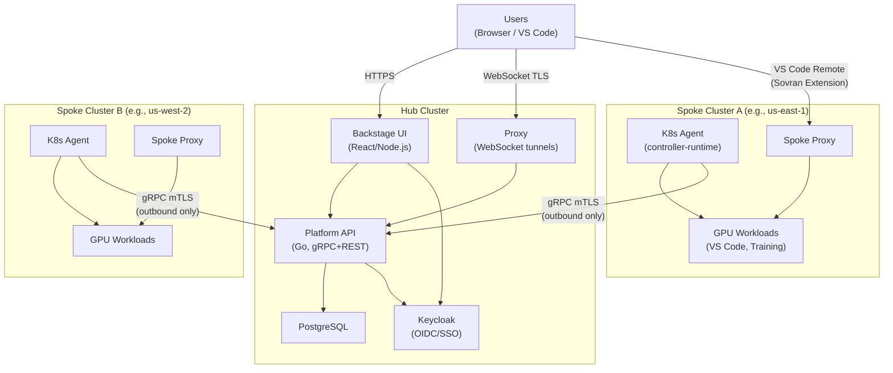

**Key design principles:**

- **Hub is stateless** (except PostgreSQL) — Can be redeployed from Helm charts in minutes
- **Spokes are autonomous** — Running workloads continue if hub goes down; they just can't receive new work
- **Outbound-only spoke connectivity** — Spokes initiate all connections to the hub. No inbound ports required on spoke clusters.
- **All inter-cluster traffic is encrypted** — mTLS with client certificates for spoke-to-hub gRPC

### 2.2 Component Inventory

| Component | Technology | Purpose | Runs On |
|-----------|-----------|---------|---------|
| **Platform API** | Go, gRPC + HTTP gateway | Workload orchestration, RBAC, budget enforcement, cluster management, audit logging | Hub |
| **Backstage UI** | React, Node.js (Backstage.io) | Web interface: workload management, cluster admin, FinOps dashboards, project management | Hub |
| **Keycloak** | Java | Identity provider: OIDC, SAML, MFA, PIV/CAC, user lifecycle | Hub |
| **PostgreSQL** | PostgreSQL 15+ | Persistent state: workloads, clusters, budgets, audit events | Hub |
| **Proxy** | Go | WebSocket reverse proxy for workspace access with session token validation | Hub |
| **K8s Agent** | Go (controller-runtime) | CRD-based workload reconciler, heartbeat reporter, capacity tracker | Each Spoke |
| **Spoke Proxy** | Go | Local WebSocket proxy for routing user connections to workspace pods | Each Spoke |
| **Sovran Extension** | TypeScript (VS Code Extension) | OIDC/PKCE auth, gRPC workspace discovery, WebSocket tunneling for VS Code Remote | User Machine |

### 2.3 Namespace Layout & Isolation

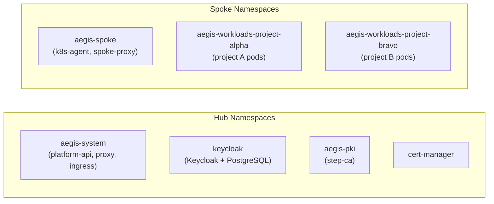

- Each **project** gets its own workload namespace (`aegis-workloads-{projectId}`) — hard tenant isolation at the Kubernetes namespace boundary
- **NetworkPolicy** enforced per namespace — workloads from different projects cannot communicate
- **PKI is externally managed** — step-ca and cert-manager are installed separately, not as Helm subcharts

### 2.4 CRD-Based Workload Lifecycle

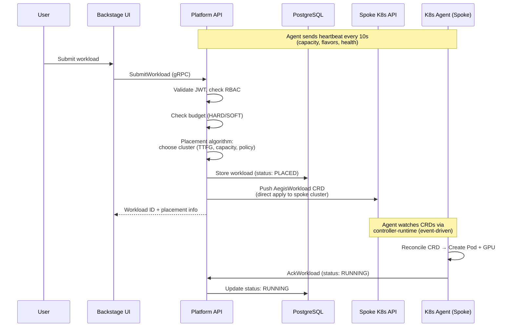

**Key architecture point:** The hub **pushes** work to spokes by creating CRDs directly on the spoke's Kubernetes API. The K8s Agent **watches** for CRDs via controller-runtime (event-driven, not polling). There is no polling loop for workload assignment.

**Workload types:**
- **WorkspaceSpec** — Interactive VS Code workspace with SSH access via WebSocket tunnel
- **TrainingSpec** — Batch GPU training job (PyTorch distributed training planned)

**Status lifecycle:** QUEUED → PLACED → RUNNING → SUSPENDED/TERMINATED

---

## 3. Security Architecture

> This is the most critical section for your presentation. Every subsection maps to questions evaluators will ask.

### 3.1 Authentication

#### OIDC/PKCE Flow via Keycloak

All user authentication goes through Keycloak using **OAuth 2.0 Authorization Code Flow with PKCE** (Proof Key for Code Exchange). This is the recommended flow for public clients and prevents authorization code interception attacks.

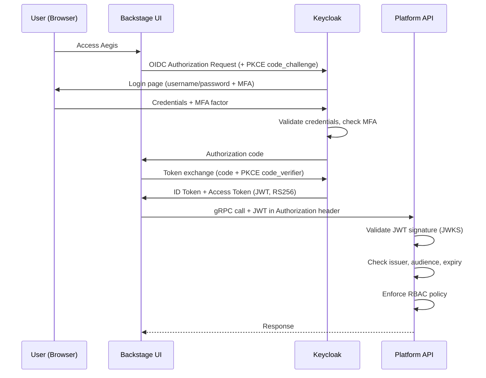

**Token validation in Platform API (`services/platform-api/internal/server/mw/auth.go`):**

- RS256/RS384/RS512 signature verification against Keycloak JWKS endpoint
- JWKS cache with 5-minute TTL
- Issuer verification
- Audience validation
- 30-second clock skew leeway
- Custom CA bundle support (`OIDC_CA_BUNDLE`) for self-signed Keycloak certificates — critical for air-gapped deployments

#### MFA Enforcement

Platform API can **require phishing-resistant MFA** at the API level, independent of Keycloak policy:

```
Environment variable: REQUIRE_PHISHING_RESISTANT_MFA=true
```

When enabled, the API validates the `amr` (Authentication Methods Reference) claim in the JWT. Only tokens containing approved factors are accepted:

| Factor | Description | Config |
|--------|------------|--------|
| `hwk` | Hardware key (FIDO2) | Default allowed |
| `webauthn` | WebAuthn authenticator | Default allowed |
| `piv` | PIV card | Default allowed |
| `piv-cac` | CAC card | Default allowed |

Configurable via: `ALLOWED_PHISHING_RESISTANT_AMR=hwk,webauthn,piv,piv-cac`

**Key talking point:** "MFA enforcement is at the API layer, not just the IdP. Even if someone bypasses Keycloak's MFA policy, Platform API independently verifies the AMR claim in the token. Defense in depth."

#### PIV/CAC Support

Keycloak supports X.509 client certificate authentication for PIV/CAC:
- Certificate-to-user mapping (Common Name, UPN, email)
- CRL and OCSP checking for certificate revocation
- Currently configured as **ALTERNATIVE** authentication (user can choose password or CAC)
- Roadmap: Enforce CAC-only for specific realms/clients

**Known gap:** Keycloak does not natively emit `amr` claims when X.509 auth is used. A custom protocol mapper or authentication flow extension is needed. This is on the roadmap.

### 3.2 Authorization (RBAC)

#### Policy Model

RBAC is enforced at the Platform API level via a JSON policy loaded from environment variable `AUTHZ_ROLE_BINDINGS_JSON`.

**File:** `services/platform-api/internal/authz/policy.go`

**Critical design decision: Fail-closed.** An empty or missing policy denies ALL requests. There is no implicit allow.

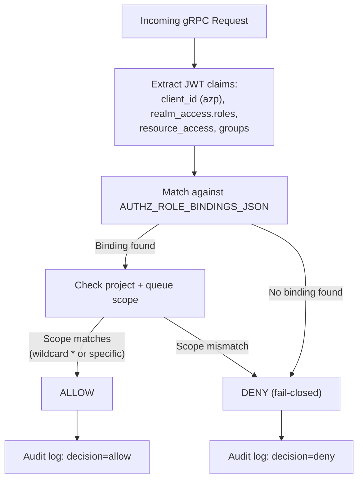

**Binding structure:**
- **Client ID matching** — Which Keycloak client made the request (backstage, vscode-extension, etc.)
- **Realm role matching** — User's realm-level roles from `realm_access.roles`
- **Resource-specific roles** — Client-specific roles from `resource_access`
- **Project scope** — Wildcard `*` or specific project ID
- **Queue scope** — Wildcard `*` or specific queue name

**Default policy:** Allows `workspace-admin` role for `backstage` and `vscode-extension` clients.

**Key talking point:** "Our RBAC is fail-closed by design. If the policy is empty, misconfigured, or missing — all requests are denied. This is the opposite of most systems that default to allow. We chose this because in a regulated environment, an open system is worse than a locked system."

### 3.3 Session Management

#### Session Tokens for Workspace Access

When a user connects to a workspace (VS Code → Proxy → Workspace Pod), the Platform API issues a **short-lived session token** (JWT).

**File:** `services/proxy/internal/server/server.go`

| Property | Value | Configurable |
|----------|-------|-------------|
| Signing algorithm | HS256 | No |
| Max TTL | **300 seconds (5 minutes)** | Yes, `AEGIS_PROXY_TOKEN_TTL_SECONDS` (cannot exceed 300s) |
| One-time use | Optional | `AEGIS_PROXY_ONE_TIME_TOKENS=true` |
| JTI enforcement | Yes — server tracks consumed JTIs | N/A |

**Token claims:**
- `sub` — User identity (Backstage catalog identifier)
- `wid` — Workload ID being accessed
- `dest` — Destination pod DNS and port
- `cluster` — Cluster ID (for routing)
- `one_time` — Boolean for single-use enforcement

#### Inactivity Timeouts

| Session Type | Idle Timeout | Configurable |
|-------------|-------------|-------------|
| Standard user | **15 minutes** | `AEGIS_PROXY_STANDARD_TIMEOUT` |
| Privileged | **10 minutes** | `AEGIS_PROXY_PRIVILEGED_TIMEOUT` |

- Last activity timestamp tracked per session (not per token issuance)
- Background cleanup every 5 minutes removes expired sessions
- Session termination logged as audit event

**Key talking point:** "Every workspace connection uses a short-lived, audience-restricted token with a maximum 5-minute lifetime. Optionally one-time use. The proxy tracks last activity independently — if a user walks away, the session terminates in 15 minutes regardless of token validity."

### 3.4 Encryption in Transit

Every network path in Aegis is encrypted:

| Flow | Protocol | Encryption | Mutual Auth |
|------|----------|-----------|-------------|
| User → Backstage UI | HTTPS | TLS 1.2+ | No (server cert only) |
| Backstage → Keycloak | HTTPS | TLS 1.2+ | No |
| Backstage → Platform API | gRPC over TLS | TLS 1.2+ | No (JWT in metadata) |
| Platform API → Spoke (K8s Agent) | gRPC | **mTLS** | **Yes — client certificate** |
| User → Workspace (via Proxy) | WebSocket over TLS | TLS 1.2+ | No (session token) |
| Sovran Extension → Platform API | gRPC over TLS | TLS 1.2+ | No (JWT in metadata) |
| Sovran Extension → Spoke Proxy | WebSocket Secure (WSS) | TLS 1.2+ | Optional (client cert from proxy ticket) |

**TLS configuration:**
- Minimum version: TLS 1.2 (TLS 1.0 and 1.1 disabled)
- Cipher suites: ECDHE-RSA-AES256-GCM-SHA384, ECDHE-RSA-AES128-GCM-SHA256 (FIPS-approved)
- HSTS headers enabled on ingress

**Key talking point:** "There is no unencrypted path in the system. Even internal service-to-service communication between the hub and spokes uses mutual TLS with client certificates. We don't trust the network — every hop is authenticated and encrypted."

### 3.5 Encryption at Rest

| Data | Storage | Encryption Mechanism | Key Management |
|------|---------|---------------------|----------------|
| User credentials | Keycloak → PostgreSQL | Database encryption (AES-256 via RDS KMS in cloud) | Customer-managed KMS keys |
| Workload metadata | Platform API → PostgreSQL | Database encryption | Same as above |
| Kubernetes Secrets | etcd | etcd encryption at rest (Kubernetes built-in) | Customer-configured |
| Container images | ECR (cloud) / DockerHub (dev) | Registry-level encryption | Registry provider |
| Audit logs | Platform API stdout → customer SIEM | Customer's SIEM encryption | Customer-managed |

**Key talking point:** "We don't handle encryption-at-rest key management ourselves. Your data is in your PostgreSQL, in your Kubernetes cluster, in your registry. You bring your own KMS keys. We designed it this way intentionally — you own the keys, you own the data."

### 3.6 PKI Architecture

Aegis uses an **internal PKI** based on step-ca and cert-manager. This means the platform does not depend on external certificate authorities or internet access for certificate operations — critical for air-gapped deployments.

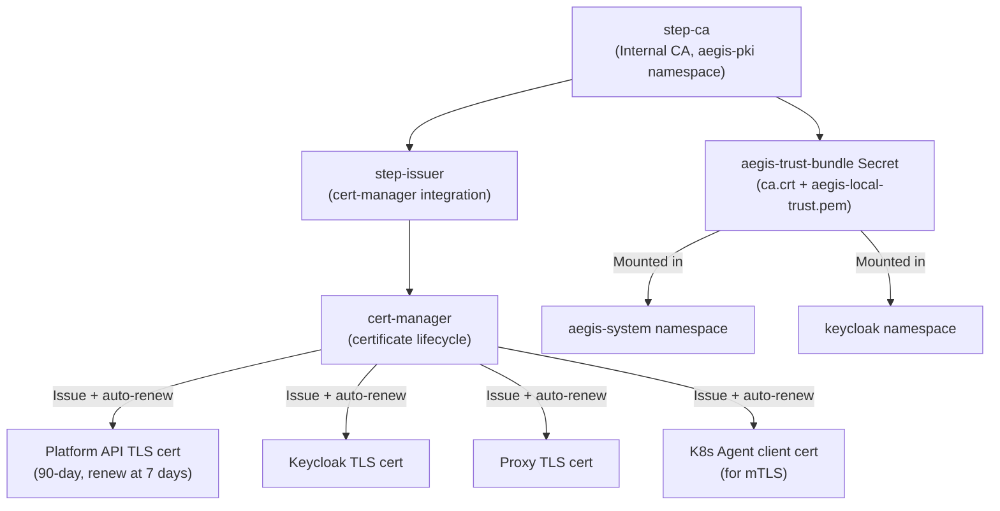

**Certificate properties:**
- Duration: **90 days** (2160 hours)
- Auto-renewal: **7 days** before expiry (168 hours)
- Trust bundle: `aegis-trust-bundle` secret distributed to `aegis-system` and `keycloak` namespaces
- Spoke proxy CA: Independent self-signed CA, auto-generated by Helm hook

**ClusterIssuer name:** `aegis-internal`

**Key talking point:** "We run our own certificate authority inside the cluster. No internet dependency for certificate operations. Certificates rotate automatically every 90 days. This is essential for air-gapped operations where you can't reach Let's Encrypt or any external CA."

### 3.7 Network Security

#### Default-Deny Posture

When deployed with the `standard` hardening profile, namespaces use **default-deny egress NetworkPolicy**. Egress is explicitly allowed only for required paths. (Default-deny ingress is on the roadmap.)

Controlled via Helm values:
```yaml
networkPolicy:
  enabled: true        # Must be true
  defaultDenyAll: true  # SC-7 Enhancement
hardeningProfile: standard  # Must NOT be "dev"
```

**Note:** In `dev` hardening profile, NetworkPolicies are completely disabled for developer convenience.

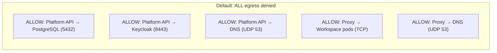

**Spoke connectivity model:**
- Spokes initiate **outbound-only** connections to the hub
- No inbound ports required on spoke clusters
- Spoke → Hub: gRPC on port 8081 (mTLS)
- Heartbeat: every 10 seconds, hub marks cluster unhealthy after 45 seconds of silence

**Per-project workload isolation:**
- Each project's workloads run in a dedicated namespace (`aegis-workloads-{projectId}`)
- NetworkPolicy prevents cross-project pod communication
- Default-deny egress for workload pods (no direct internet access)

**Key talking point:** "Spokes never accept inbound connections. They always initiate outbound. Your GPU clusters can sit behind the strictest firewall — they only need one outbound gRPC port to the hub. And workloads from different projects are namespace-isolated with NetworkPolicy enforcement."

### 3.8 Secure Mode (Sovran VS Code Extension)

The Sovran extension has a **secure mode** (`AEGIS_SECURE_LAUNCH=1`) designed for handling Controlled Unclassified Information (CUI):

| Feature | Normal Mode | Secure Mode |
|---------|------------|-------------|
| Token storage | VS Code SecretStorage (persisted) | **In-memory only** (ephemeral) |
| Refresh tokens | Requested (`offline_access`) | **Disabled / stripped** |
| TLS verification | Configurable | **Forced on** |
| Log level | User configurable | **Clamped to `info`** |
| Log content | URLs and bodies logged | **Redacted / suppressed** |
| Automation login | Password grant allowed (dev) | **Disabled entirely** |
| On exit | Session revocation | **Revocation + secret wipe** |

**Secure launcher flow:**
1. Verify FileVault (macOS) or LUKS (Linux) full-disk encryption is enabled
2. Create a **RAM disk** (256 MB default) — data never touches persistent storage
3. Launch VS Code in sandbox with `AEGIS_SECURE_LAUNCH=1`
4. On exit: destroy RAM disk, wipe all secrets from memory

**Key talking point:** "For CUI environments, the VS Code extension runs in secure mode. Tokens exist only in memory — they're never written to disk. All logs are redacted. On exit, we destroy the RAM disk. If the machine is stolen powered off, there's nothing to recover."

### 3.9 Audit Logging

All security-relevant events are logged as structured JSON to stdout. Every audit record includes fields compliant with NIST AU-3:

| Field | Description | Example |
|-------|------------|---------|
| `timestamp` | UTC, ISO 8601 | `2026-03-13T14:30:00.123Z` |
| `level` | Log level | `info` |
| `component` | Source service | `platform-api` |
| `event` | Event type | `auth_login`, `authz_denied`, `workload_submit` |
| `subject` | Authenticated identity | `user:default/cms553` |
| `client_id` | Keycloak client | `backstage` |
| `source_ip` | Client IP address | `192.0.2.100` |
| `method` | gRPC method or HTTP path | `/aegis.v1.AegisPlatform/SubmitWorkload` |
| `decision` | Authorization outcome | `allow`, `deny` |
| `request_id` | Correlation ID | `req-12345` |

**Event categories logged:**
- Authentication: login, logout, MFA events, token validation failures
- Authorization: access decisions (allow/deny), role checks, project scope checks
- Workload lifecycle: submit, place, lease, ack, start, suspend, terminate
- Administrative: configuration changes, cluster registration, budget modifications

**Log export:** stdout → customer's log pipeline (Fluent Bit, Fluentd, CloudWatch, Splunk, ELK)

**Prometheus metrics (built-in):**
- `aegis_auth_failures_total` — Auth failures by reason (missing_token, invalid_token, mfa_required)
- `aegis_workload_placed_total` — Workloads placed by flavor
- `aegis_workload_queue_wait_seconds` — Queue time histogram
- `aegis_budget_denied_total` — Budget denials by reason

**Key talking point:** "Every authentication attempt, every authorization decision, every workload state change is logged as structured JSON with who, what, when, where, and outcome. Your SIEM can ingest it directly. We also export Prometheus metrics for real-time alerting on things like auth failure spikes."

---

## 4. Data Protection & Data Flows

### 4.1 Data Classification

| Data Type | Where It Lives | Encryption in Transit | Encryption at Rest | Retention | Sensitivity |
|-----------|---------------|----------------------|-------------------|-----------|-------------|
| User credentials (passwords, MFA secrets) | Keycloak PostgreSQL | TLS 1.2+ | DB encryption (RDS KMS) | Per customer policy | HIGH |
| JWT tokens (access, ID) | Memory + wire | TLS 1.2+ | N/A (never persisted by Aegis) | 5 minutes max | HIGH |
| Session tokens (proxy tickets) | Memory + wire | TLS 1.2+ | N/A | 300 seconds max | HIGH |
| Workload metadata (specs, status) | Platform API PostgreSQL | TLS 1.2+ | DB encryption | 90 days default | MEDIUM |
| Cluster state (heartbeats, capacity) | Platform API PostgreSQL | mTLS | DB encryption | Current + history | MEDIUM |
| Audit logs | Platform API stdout | TLS to SIEM | Customer's SIEM | 90+ days | MEDIUM |
| Container images | ECR / customer registry | TLS | Registry encryption | Per customer policy | MEDIUM |
| Budget data | Platform API PostgreSQL | TLS 1.2+ | DB encryption | Per customer policy | LOW-MEDIUM |
| Keycloak realm config | Keycloak PostgreSQL | TLS 1.2+ | DB encryption | Per customer policy | HIGH |
| AWS cross-account credentials | Kubernetes Secrets | TLS (K8s API) | etcd encryption | Deployment lifetime | CRITICAL |

### 4.2 Authentication Data Flow

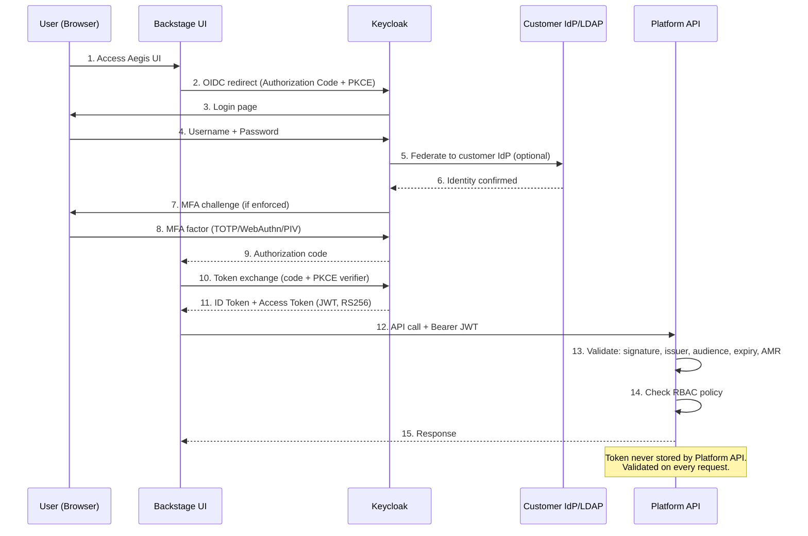

### 4.3 Workload Submission Data Flow

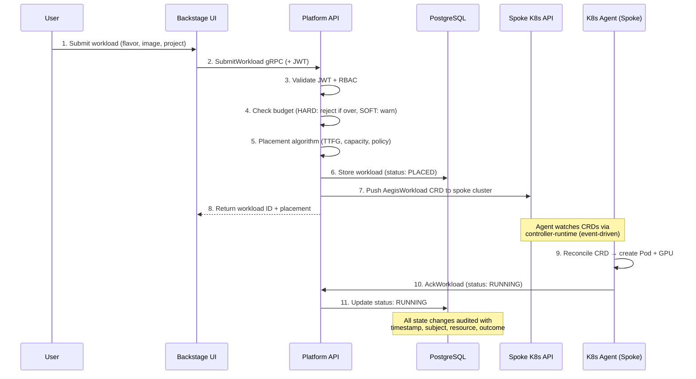

### 4.4 VS Code Workspace Connection Flow (Sovran Extension)

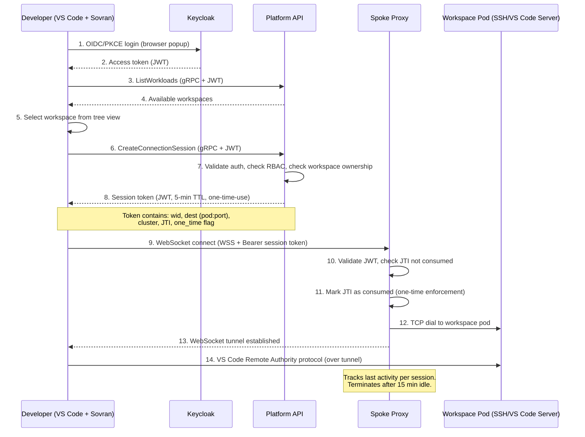

### 4.5 Where Data Does NOT Go

Important for security-conscious customers:

- **No telemetry to Aegis vendor** — The platform phones home to nobody. It's self-hosted.
- **No data leaves the customer's boundary** — All processing, storage, and logging happen inside the deployment.
- **No cloud dependencies at runtime** — If deployed air-gapped, the platform functions without internet access (after initial image pull).
- **No PII in workload specs** — Workload definitions contain resource requests, image refs, and env vars. No personal data in the scheduling path.
- **JWT tokens are never persisted** — Validated in memory on every request, then discarded.

---

## 5. Compliance Posture

### 5.1 What the Platform Enforces Today (In Code)

These are **running features**, not documentation:

| Security Capability | Implementation | NIST Control Supported |
|--------------------|---------------|----------------------|
| OIDC/PKCE authentication via Keycloak | `auth.go`, `auth-keycloak-provider.ts` | IA-2 |
| MFA enforcement (phishing-resistant) | `auth.go` — AMR claim validation | IA-2(1) |
| PIV/CAC support | Keycloak X.509 authentication | IA-2(12) |
| Fail-closed RBAC | `policy.go` — empty policy = deny all | AC-3, AC-6 |
| Session idle timeouts | `server.go` — 15min standard, 10min privileged | AC-11 |
| Short-lived session tokens (5-min max) | Proxy JWT with JTI enforcement | AC-12, AC-17 |
| One-time-use tokens | JTI store prevents reuse | AC-17 |
| TLS 1.2+ on all connections | gRPC, HTTPS, WSS | SC-8 |
| mTLS for spoke-to-hub | Client certificates via cert-manager | SC-8, SC-7 |
| Structured audit logging (JSON, AU-3 fields) | All services — stdout + Prometheus | AU-2, AU-3, AU-8 |
| Default-deny egress NetworkPolicy | Helm templates (standard hardening profile) | SC-7 |
| Outbound-only spoke connectivity | Architecture design | SC-7 |
| Per-project namespace isolation | Dynamic namespace creation | AC-3, SC-7 |
| Internal PKI (no internet dependency) | step-ca + cert-manager | SC-12, SC-13 |
| Password policy enforcement | Keycloak realm configuration | IA-5 |
| Account lockout (brute force protection) | Keycloak built-in | AC-7 |
| Secure mode (CUI protection) | Sovran extension — RAM disk, ephemeral tokens | MP-7, SC-28 |
| Log redaction in secure mode | `secure-mode.ts` — URL, settings, payload redaction | AU-3 |

### 5.2 Target Compliance Frameworks

We designed the architecture with these frameworks in mind. We do **not** hold these certifications today. The technical controls are implemented; the formal documentation and assessment process is on our roadmap.

| Framework | Status | What Exists | What's Needed |
|-----------|--------|------------|---------------|
| **NIST 800-53 Rev 5** | Architecture supports ~40 controls | Code implements the technical controls | Formal control documentation as product deliverables |
| **NIST 800-171 / CMMC L2** | Foundation built | Sovran compliance mapping (`controls.map.yaml`) | Full 110-practice SSP mapping, 3PAO assessment |
| **FedRAMP** | Architecture designed for it | Self-hosted model simplifies (customer's ATO) | Customer sponsors assessment, or we pursue LI-SaaS |
| **SOC 2 Type II** | Controls in place | Audit logging, access controls, encryption | Formal audit engagement |
| **ISO 27001** | Controls align | Architecture supports Annex A controls | ISMS documentation, internal audit |
| **DoD IL-4/IL-5** | Designed for it | mTLS, session management, data classification fields | FIPS crypto, full mTLS, formal assessment |

### 5.3 Shared Responsibility Model

**What Aegis provides (in the platform code):**
- Authentication (OIDC + MFA enforcement)
- Authorization (RBAC, fail-closed)
- Encryption (TLS/mTLS, certificate management)
- Audit logging (structured JSON, Prometheus metrics)
- Network isolation (NetworkPolicy, namespace boundaries)
- Session management (timeouts, one-time tokens)

**What the customer configures:**
- Keycloak realm settings (password policy, MFA requirements, session lifetimes)
- RBAC policy JSON (role bindings, project/queue scopes)
- Helm values (hardening profile, timeout values, FIPS mode)
- Network infrastructure (VPC, security groups, firewall rules)
- Log export destination (SIEM integration)

**What the customer owns entirely:**
- Physical security (inherited from AWS or on-prem)
- Personnel security (background checks, access reviews)
- Incident response process
- Contingency planning and DR testing
- Security planning documentation (SSP, POA&M)
- Compliance assessment and ATO process

### 5.4 Compliance Documentation Roadmap

We have internal drafts of customer-facing compliance documentation (control implementation statements, security architecture guide, hardening guide, incident response runbook). These were created during development to validate our architecture against compliance requirements. **Productizing these as official deliverables is on our near-term roadmap.**

Planned deliverables:
- Control Implementation Statements (CIS) for customer SSP Section 13
- Security Architecture Guide for ATO packages
- Configuration Hardening Guide
- Incident Response Runbook template
- Customer Responsibility Matrix

---

## 6. Networking Architecture

### 6.1 Deployment Topologies

#### Full Cloud (EKS)

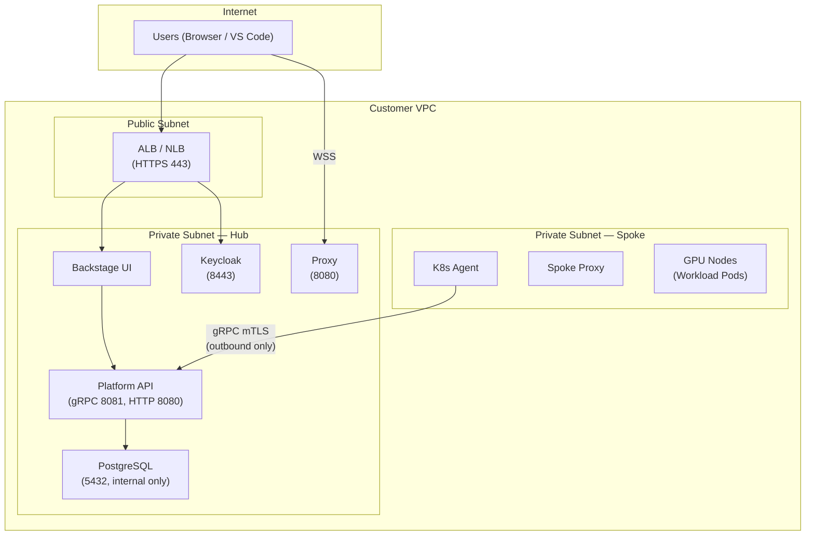

**DNS (Cloudflare-managed):**
- `ui.aegis-platform.tech` — Backstage UI
- `keycloak.aegis-platform.tech` — Keycloak
- `platform-api.aegis-platform.tech` — Platform API (direct NLB, not through ingress)
- `proxy.aegis-platform.tech` — Proxy (direct NLB)

#### Hybrid (Local Hub + Cloud Spoke) — DEVELOPMENT ONLY

> **This is not a production topology.** This exists so a single developer can run the full hub-spoke flow locally while testing against real GPU clusters in the cloud. Customers would never use this — in production, the hub runs on EKS alongside the spokes.

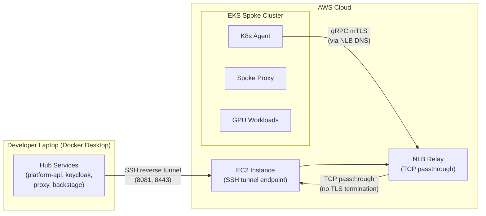

**Why two pieces:** The SSH tunnel bridges your laptop (behind NAT) into the AWS VPC. The NLB provides a stable DNS name and health checks for the spoke to target. Together they let the spoke agent reach your laptop's Platform API as if it were in AWS. In production, none of this exists — spokes connect directly to the Platform API's LoadBalancer service.

### 6.2 Port Reference

| Component | Container Port | Service Port | Protocol | Purpose |
|-----------|---------------|-------------|----------|---------|
| Platform API | 8081 | 8081 | gRPC over TLS | Control plane (workloads, clusters, auth) |
| Platform API | 8080 | 8080 | HTTP | REST gateway, health checks, Prometheus |
| Proxy | 8080 | 8085/443 | WSS | WebSocket workspace tunnels |
| Keycloak | 8443 | 8443 | HTTPS | OIDC token endpoint, admin console |
| PostgreSQL | 5432 | 5432 | TCP | Database (internal only) |
| K8s Agent | 8081 | N/A | HTTP | Health/readiness probe |
| ingress-nginx | 80/443 | 80/443 | HTTP/HTTPS | TLS termination for UI + Keycloak |

### 6.3 Required Firewall Rules

**Hub inbound (from internet/users):**

| Source | Destination | Port | Protocol | Purpose |
|--------|------------|------|----------|---------|
| Users | ALB/Ingress | 443 | HTTPS | UI + Keycloak access |
| Users | Proxy NLB | 443 | WSS | Workspace connections |

**Hub inbound (from spokes):**

| Source | Destination | Port | Protocol | Purpose |
|--------|------------|------|----------|---------|
| Spoke K8s Agent | Platform API | 8081 | gRPC (mTLS) | Registration, heartbeat, lease |

**Spoke — NO inbound ports required.**

**Spoke outbound:**

| Source | Destination | Port | Protocol | Purpose |
|--------|------------|------|----------|---------|
| K8s Agent | Hub Platform API | 8081 | gRPC (mTLS) | Control plane |
| Spoke Proxy | Hub | 443 | TLS | Tunnel setup |
| All pods | Container registry | 443 | HTTPS | Image pull |

### 6.4 Trust Boundaries

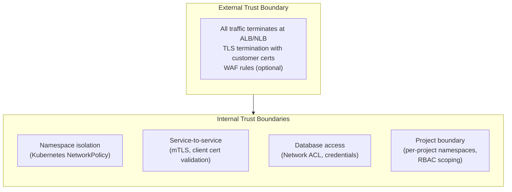

---

## 7. API Surface & Integration Points

### 7.1 gRPC Service Catalog

**Protobuf:** `proto/aegis/v1/platform.proto`

All endpoints require JWT authentication. Authorization checked per RBAC policy.

#### Workload Lifecycle

| Method | Description | Who Calls It |
|--------|------------|-------------|
| `SubmitWorkload` | Submit new workload (workspace or training) | UI, VS Code Extension |
| `GetWorkload` | Get workload details by ID | UI, VS Code Extension |
| `ListWorkloads` | List workloads (filtered by project, status) | UI, VS Code Extension |
| `LeaseWorkload` | Claim available workload for execution | K8s Agent (spoke) |
| `AckWorkload` | Acknowledge workload status change | K8s Agent (spoke) |
| `StartWorkload` | Start a previously placed workload | K8s Agent (spoke) |
| `TerminateWorkload` | Terminate a running workload | UI, Admin, API |
| `ResumeWorkload` | Resume a suspended workload | UI |

#### Cluster Management

| Method | Description | Who Calls It |
|--------|------------|-------------|
| `RegisterCluster` | Register new spoke cluster | K8s Agent (on startup) |
| `Heartbeat` | Report cluster health + capacity (10s interval) | K8s Agent (continuous) |
| `ListClusters` | List registered clusters | UI |
| `ImportCluster` | Import existing cluster (kubeconfig/assume-role/endpoint) | Admin API |
| `CreateCluster` | Provision new EKS cluster (Pulumi) | Admin API |

#### Session & Access

| Method | Description | Who Calls It |
|--------|------------|-------------|
| `CreateConnectionSession` | Mint JWT proxy ticket for workspace | UI, VS Code Extension |
| `RenewConnectionSession` | Refresh proxy ticket before expiry | VS Code Extension |
| `RevokeConnectionSession` | Revoke active session | UI, Admin, Extension |

#### Project & Budget

| Method | Description | Who Calls It |
|--------|------------|-------------|
| `CreateProject` | Create new project with policy domain | Admin |
| `ListProjects` | List projects (filtered) | UI |
| `UpsertBudget` | Create/update budget (HARD or SOFT) | Admin |
| `GetBudget` / `ListBudgets` | Query budget status | UI |
| `UpsertFlavor` | Define GPU flavor (e.g., A100, H100) | Admin |
| `UpsertQueue` | Define scheduling queue | Admin |

### 7.2 Backstage UI Integration

The UI communicates with Platform API through a **Backstage proxy backend**:

```
Browser → Backstage Backend (Node.js) → /api/proxy/aegis/* → Platform API (REST gateway)
```

- Keycloak JWT is forwarded in `Authorization` header
- Backend proxy adds `Grpc-Metadata-Authorization` for gRPC-Web compatibility
- CORS: origin-restricted, credentials enabled
- CSP headers enforced via Helmet

### 7.3 Sovran VS Code Extension Integration

The extension communicates directly with Platform API via gRPC (not through the UI proxy):

1. **Auth:** OIDC/PKCE directly with Keycloak (browser popup)
2. **Workspace discovery:** `ListWorkloads` via gRPC
3. **Connection:** `CreateConnectionSession` → WSS to spoke proxy
4. **Renewal:** `RenewConnectionSession` at 85% token TTL
5. **Cleanup:** `RevokeConnectionSession` on disconnect

---

## 8. Operational Capabilities

### 8.1 Platform Features (Built & Running)

| Capability | Implementation | How It Works |
|-----------|---------------|-------------|
| **Structured JSON logging** | All Go services | Every event logged with AU-3 compliant fields to stdout |
| **Prometheus metrics** | Platform API `/metrics` endpoint | Auth failures, workload placement, queue wait times, budget denials |
| **Health check endpoints** | K8s Agent `/readyz` | Kubernetes readiness/liveness probes |
| **Cluster heartbeat** | K8s Agent → Platform API every 10s | Reports capacity, TTFG, available flavors; hub detects stale after 45s |
| **Helm-based deployment** | Charts for hub (`aegis-services`) and spoke (`aegis-spoke`) | Reproducible deployments, rollback via `helm rollback` |
| **Terraform IaC** | `terraform/` directory | EKS, VPC, IAM, ECR infrastructure as code |
| **Session revocation API** | `RevokeConnectionSession` gRPC | Immediately terminate a user's workspace connection |
| **Workload termination API** | `TerminateWorkload` gRPC | Immediately kill a running workload |
| **Keycloak account management** | Keycloak Admin API | Disable accounts, invalidate sessions, force password reset |
| **Database migrations** | Versioned SQL migrations in Helm chart | Schema versioning with up/down migrations |

### 8.2 Platform Hooks That Enable Customer Operations

The platform provides the **technical hooks** that customers use to build their operational processes:

- **Incident containment:** Disable Keycloak accounts, revoke sessions, terminate workloads, apply NetworkPolicy isolation
- **Recovery:** Helm redeploy from Git-tracked charts, Terraform re-apply, spoke auto-reconnection via heartbeat
- **Audit investigation:** Structured JSON logs exportable to any SIEM, Prometheus metrics for anomaly detection
- **Configuration management:** Helm values as canonical baseline, Git-tracked, diff-able

### 8.3 What We Plan to Formalize (Roadmap)

- Customer-facing compliance documentation as product deliverables (IR runbook templates, hardening guides, evidence collection tooling)
- SBOM generation integrated into CI/CD
- Automated compliance scanning and reporting

---

## 9. Current Capabilities — What's Built

### 9.1 Feature Status Matrix

| Feature | Status | Notes |
|---------|--------|-------|
| **Multi-cluster hub-spoke architecture** | BUILT | Heartbeat, stale detection, soft-delete with grace period |
| **GPU placement algorithm** | BUILT | TTFG + spread strategies, policy constraints (region, flavor, IL-level) |
| **Budget enforcement** | BUILT | HARD (reject) and SOFT (warn) modes, transactional locking, Prometheus metrics |
| **Structured audit logging** | BUILT | JSON events with AU-3 fields, exportable to SIEM |
| **RBAC (fail-closed)** | BUILT | JSON policy, project/queue scoping, audit of all decisions |
| **OIDC + PKCE authentication** | BUILT | Keycloak integration, MFA enforcement, AMR validation |
| **JWT session tokens** | BUILT | HS256, single-use JTI, 5-min max TTL, audience-restricted |
| **VS Code workspace access** | BUILT | WebSocket tunnels via Sovran extension, 85% TTL auto-renewal |
| **Network isolation** | BUILT | Default-deny egress (standard profile), per-project namespaces, NetworkPolicy templates |
| **Multi-tenancy** | BUILT | Per-project namespaces, per-project AWS credentials, RBAC scoping |
| **Internal PKI** | BUILT | step-ca + cert-manager, auto-rotation, no internet dependency |
| **Interactive workspaces** | BUILT | VS Code Server in pod, SSH access via WebSocket tunnel |
| **Batch training jobs** | BUILT | Job spec → Pod with GPU, status tracking |
| **Cluster provisioning (EKS)** | BUILT | Pulumi Automation API: VPC + EKS + IAM from API call |
| **Cluster import** | BUILT | Kubeconfig, assume-role, or endpoint/CA methods |
| **FinOps dashboards** | BUILT | Budget tracking, cost estimation, quota management in UI |
| **Backstage UI** | BUILT | 23+ pages: workloads, clusters, projects, budgets, metrics, logs, admin |
| **Secure mode (CUI)** | BUILT | RAM disk, FDE check, ephemeral tokens, log redaction |
| **Helm charts (hub + spoke)** | BUILT | Production-ready with hardening profiles (dev, standard) |
| **Terraform infrastructure** | BUILT | EKS, VPC, ECR, IAM — full IaC |
| **Workload suspend/resume** | BUILT | Annotations with reason/timestamp, cleanup scheduling |
| **Project policy domains** | BUILT | Allowed regions, data classification (IL-1 through IL-5) |

### 9.2 What's Partial or Planned

| Feature | Status | What's Done | What's Missing |
|---------|--------|------------|----------------|
| **FIPS 140-3 cryptography** | PLANNED | Architecture supports it | Go BoringCrypto build, UBI9 FIPS images, Keycloak FIPS mode |
| **Full mTLS spoke-to-hub** | PARTIAL | Hub enforces client certs when present | Spoke client cert loading not wired, cert-manager template needed |
| **PIV/CAC enforcement** | PARTIAL | Keycloak X.509 configured as ALTERNATIVE | AMR claim mapper missing, DoD Browser auth flow needed |
| **Audit log viewer (UI)** | PARTIAL | Backend collects events fully | UI component exists but not wired to API |
| **IL-level data classification enforcement** | PARTIAL | `dataLevelSatisfied()` logic works | Input validation, violation audit events, spoke config needed |
| **Kueue fair queuing** | PARTIAL | Full controller implementation exists | Helm values don't expose `kueue.enabled` env var |
| **PyTorch distributed training** | PARTIAL | `BuildPyTorchJob()` function exists | Controller never calls it (uses simple batch/v1 Job) |
| **Customer compliance documentation** | PLANNED | Internal drafts exist | Not yet productized as official deliverables |

---

## 10. Technical Roadmap & Known Gaps

### Phase 1: Security Foundation (Highest Priority)

#### Gap 1: FIPS 140-3 Cryptography

**Why it matters:** No defense customer will deploy a platform that doesn't use FIPS-validated cryptography. This is a hard requirement, not a nice-to-have.

**Current state:** Go services use standard Go crypto library. Not FIPS-validated.

**Plan:**
- Build Go services with `GOEXPERIMENT=boringcrypto` (BoringSSL — FIPS-validated)
- Switch container base images to UBI9 with FIPS mode enabled
- Configure Keycloak with `KC_FIPS_MODE=strict`
- Node.js (Backstage) built with FIPS OpenSSL module

**Effort:** 2-4 weeks, ~14 files

**Talking point:** "FIPS is our top priority. The plan is concrete — we know the exact files, the exact build flags, and the exact timeline. This isn't vaporware."

#### Gap 2: Full mTLS Spoke-to-Hub

**Current state:** Hub validates client certs when presented. Spoke agent doesn't load client certs yet.

**Plan:**
- Add client cert loading to K8s Agent
- Create cert-manager Certificate template for spoke client certs
- Add Helm values for cert paths

**Effort:** 1-2 weeks, ~6 files

#### Gap 3: PIV/CAC Enforcement

**Current state:** Keycloak X.509 is configured as ALTERNATIVE. AMR claims not emitted for X.509 auth.

**Plan:**
- Create DoD Browser authentication flow in Keycloak
- Add protocol mapper for AMR claims on X.509 auth
- Add configuration toggle for CAC-required mode

**Effort:** ~1 week, ~3 files

### Phase 2: Compliance Visibility

#### Gap 4: Audit Log Viewer (UI)

**Current state:** Backend collects all audit events. UI component stub exists but isn't connected to an API.

**Plan:** Add proto RPC for querying audit events, implement handler, wire UI component.

**Effort:** 3-5 days, ~5 files

#### Gap 5: IL-Level Data Classification Enforcement

**Current state:** `dataLevelSatisfied()` logic works. Missing: input validation, violation audit events, IL level in spoke Helm config.

**Effort:** 2-3 days, ~3 files

### Phase 3: Operational Features

#### Gap 6: Kueue Fair Queuing (Helm Exposure)

**Current state:** Full controller implementation exists. Helm values don't expose the env vars to enable it.

**Effort:** ~1 day, ~2 files

#### Gap 7: PyTorch Distributed Training

**Current state:** `BuildPyTorchJob()` function exists. Controller uses simple batch/v1 Job instead.

**Plan:** Wire controller dispatch, add NCCL env vars, Kueue labels.

**Effort:** ~1 week, ~3 files

### Roadmap Summary

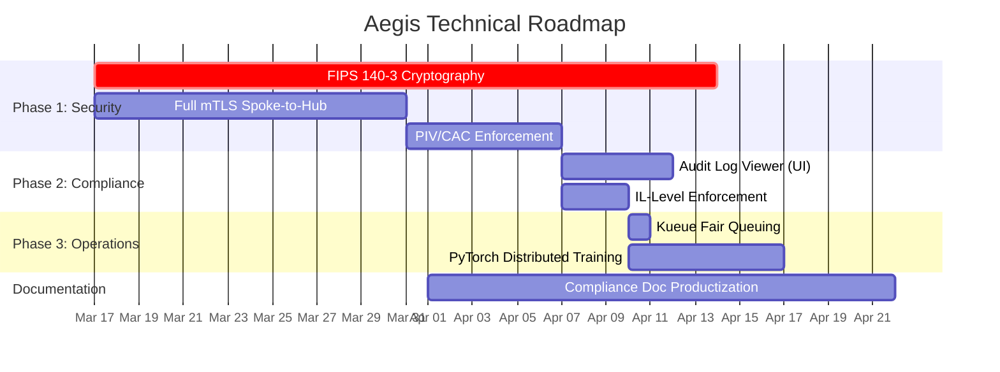

---

## 11. Competitive Positioning

### 11.1 Aegis vs. DIY Kubeflow

| Dimension | Aegis | DIY Kubeflow |
|-----------|-------|-------------|
| **Time to first GPU** | ~1 week (Helm install) | 12-20 weeks (assemble 12+ components) |
| **Authentication** | Built-in (Keycloak OIDC, MFA, PIV/CAC) | Manual integration (oauth2-proxy + Keycloak) |
| **Authorization** | Built-in RBAC (fail-closed) | Manual (OPA/Gatekeeper + custom policies) |
| **Audit logging** | Built-in (AU-3 compliant, structured JSON) | Manual (custom logging middleware) |
| **Multi-cluster** | Native (hub-spoke, placement algorithm) | Not built-in (requires custom federation) |
| **Budget enforcement** | Built-in (HARD/SOFT, per-queue) | Not available (requires custom development) |
| **Session management** | Built-in (timeouts, one-time tokens) | Not available |
| **Network isolation** | Built-in (default-deny, per-project) | Manual (custom NetworkPolicy) |
| **Compliance documentation** | Planned (internal drafts exist) | Customer builds from scratch |
| **Estimated 3-year cost** | ~$1.5M (license + minimal engineering) | ~$4.6M (12+ FTEs, 20+ weeks setup) |

### 11.2 The Three Environments — Where Aegis Fits

This distinction is critical. These three environments are frequently confused, and getting it wrong in a customer conversation will lose credibility with ISSMs and security officers.

| Environment | What It Is | Examples | Who Builds It Today |
|---|---|---|---|
| **True air-gap** | Physically disconnected. No wire to the outside. Walk into a facility, sit at a terminal. | TS/SCI SCIFs, submarine networks, JWICS, tactical edge | Government-managed, physical security controls |
| **Simulated air-gap** | Network-connected but heavily restricted. VPCs, firewalls, Transit Gateway, NFW. Engineers access via VPN or Workspaces VM. Data doesn't leave, but there IS connectivity. | CUI/IL-4/IL-5 contractor environments, most DoD unclassified-but-regulated setups | Contractors spend 3-6 months assembling TGW + NFW + AD + Workspaces + Kubeflow |
| **Connected/regulated** | Cloud infrastructure with security controls, not air-gapped. | Commercial regulated (HIPAA, FedRAMP) | Standard cloud security practices |

**Aegis targets the simulated air-gap market — which is 90%+ of the DoD CUI/IL-4/IL-5 market.** These organizations spend months assembling network infrastructure to achieve air-gapped-level security. Their engineers hate the experience (VM hop, browser-based Jupyter, latency). Aegis gives them the same security outcome through cryptographic controls, deployable in days, with native VS Code.

**Aegis does NOT claim to replace true air-gaps.** For TS/SCI, physical disconnection is the only answer. Aegis can deploy inside a true air-gapped network (spoke runs autonomously, images delivered via content drop), but the primary value — eliminating the VM hop and infrastructure complexity — applies to simulated air-gaps.

### 11.3 Aegis vs. Traditional Simulated Air-Gap ML Infrastructure

Most CUI-compliant ML environments are built by assembling AWS infrastructure: Workspaces VMs for access, Transit Gateway for cross-VPC routing, Network Firewall for egress inspection, Microsoft AD for auth, and Kubeflow on EKS for ML workloads — coordinated across 4+ AWS accounts. This takes months and the developer experience is painful. **These are simulated air-gaps, not true air-gaps** — they have network connectivity everywhere, controlled by firewall rules.

**The before/after:**

| Dimension | Traditional Simulated Air-Gap | Aegis |
|-----------|-------------------------------|-------|
| **User access** | RDP into AWS Workspaces VM → open browser → navigate to Kubeflow → use Jupyter | Open VS Code → click "Connect" → full native IDE on GPU workspace |
| **Session setup** | 5-10 minutes (VM boot, browser nav, auth) | 30 seconds |
| **IDE quality** | Browser-based Jupyter on a remote VM (laggy, limited debugging) | Native VS Code Remote with terminal, debugging, port forwarding, LSP |
| **Deploy time** | 3-6 months (TGW, NFW, AD, Workspaces, EKS, Kubeflow, DNS) | 1-5 days (Helm charts + spoke agent) |
| **Infrastructure** | 15+ components: Transit Gateway, Network Firewall, NAT Gateways, VPC Endpoints, Microsoft AD, Workspaces, ALB, Route53, multiple EKS clusters | 3 components: hub cluster, spoke cluster, Helm charts |
| **AWS accounts** | 4+ (infra, directory, collab, project-specific) | 1 (or 0 — runs on any Kubernetes) |
| **Terraform** | 5,000-10,000+ lines across modules | ~500 lines |
| **Security model** | Simulated air-gap via network perimeter: VPC boundaries + firewall rules + AD | Zero-trust with cryptographic verification: mTLS + single-use JWT + OIDC PKCE + Sovran RAM-disk |
| **NIST 800-171** | Via infrastructure controls (VPC isolation, AD policies, NFW rules) | 88% native coverage + Sovran secure mode for CUI |

**Why this matters:** The traditional approach builds a simulated air-gap from network primitives and forces engineers inside it via a VM. Aegis achieves the same security outcome — controlled access, no data exfiltration, full audit trail — through cryptographic controls instead of network infrastructure. Engineers get a native IDE instead of a remote desktop.

**Key line:** "Your team is spending months building a simulated air-gap from Transit Gateway, Network Firewall, and Workspaces — and your engineers hate using it. Aegis gives you the same security controls in a week, with mTLS, single-use tokens, and full audit trail. Your engineers get VS Code instead of a remote VM."

### 11.4 Zero-Trust Cryptographic Controls vs. Network Perimeter Controls

Traditional simulated air-gap environments rely on **network-level isolation**: VPC boundaries, firewalls, Transit Gateway route tables, and Network Firewall inspection. Security depends on correctly configuring network rules — a misconfigured firewall rule can expose the entire boundary.

Aegis uses **zero-trust cryptographic verification**: every connection is verified with mTLS certificates, every session uses a single-use JWT (5-minute TTL, JTI tracking), and the Sovran VS Code extension runs CUI data in a RAM-disk sandbox with full-disk encryption verification.

| Property | Network Perimeter (Simulated Air-Gap) | Zero-Trust (Aegis) |
|----------|---------------------------------------|---------------------|
| **Failure mode** | Misconfigured firewall = breach (fail-open) | Missing certificate = connection refused (fail-closed) |
| **Lateral movement** | Depends on correct network segmentation | mTLS + namespace isolation + RBAC — any single layer can fail and others hold |
| **CUI on endpoint** | Data stays in VM (no local persistence) | Sovran secure mode: RAM-disk + FDE verification + ephemeral tokens |
| **Auditability** | VPC Flow Logs + CloudTrail | Structured JSON audit events per request with subject, action, resource, outcome |
| **Infrastructure dependency** | Requires Transit Gateway, NFW, VPC Endpoints | Runs on any Kubernetes cluster |

**Important:** Neither approach is a true air-gap. Both have network connectivity. The difference is how security is enforced — network rules vs. cryptographic verification. Aegis's zero-trust model is stronger against misconfiguration (fail-closed instead of fail-open) and dramatically simpler to deploy and maintain.

**Key line:** "We don't trust the network — we verify every connection cryptographically. A misconfigured firewall rule in a traditional simulated air-gap can expose your entire CUI boundary. With Aegis, every service has a certificate, every session has a one-time token, and every action is audited. If anything is wrong, the connection is refused — not silently passed through."

### 11.5 Developer Experience Transformation

The single biggest pain point in traditional regulated ML environments is developer experience. Engineers forced through multiple network hops to reach their compute resources lose hours per week to latency and context switching.

**Traditional path (5+ hops):**
```
Engineer → AWS Workspaces (RDP boot: 2-5 min) → Browser → Kubeflow UI → Jupyter Notebook
```

**Aegis path (1 hop):**
```
Engineer → VS Code → Click "Connect" (30 sec) → Full IDE on GPU workspace pod
```

**What engineers get with Aegis:**
- Native VS Code Remote window — not a browser-based editor, not a VDI session
- Full terminal with GPU access (nvidia-smi, CUDA, PyTorch)
- Debugging, breakpoints, profiling — the full VS Code extension ecosystem
- Port forwarding for TensorBoard, MLflow, and other tools running in the workspace
- Jupyter extension in VS Code (native kernel, not browser Jupyter)
- File operations at local speed (VS Code Remote handles sync transparently)

**Quantified impact:**
- Session setup: 10 min → 30 sec (**20x faster**)
- Context switches per day: 5+ → 1 (open VS Code, start working)
- Estimated time saved per engineer: 5-10 hours/month

### 11.6 Why Self-Hosted Matters for Defense

- **No FedRAMP dependency** — Aegis deploys inside the customer's existing ATO boundary. No separate cloud service authorization needed.
- **Air-gap compatible** — Internal PKI, no runtime internet dependencies. Content drops for updates.
- **Data sovereignty** — All data stays in the customer's environment. No vendor-hosted components.
- **Auditability** — Customer has full access to all code, configuration, logs. No black boxes.

### 11.7 What Aegis Is NOT (and MLOps Integration Strategy)

Aegis is **not** an ML framework, training library, or MLOps suite. It's a **multi-cluster GPU control plane** for regulated environments.

**What Aegis handles:**
- GPU workload scheduling and placement across clusters
- Secure remote workspaces (VS Code Remote)
- Identity, RBAC, audit logging, session management
- Budget enforcement and FinOps
- Compliance controls (NIST 800-171, CUI handling)

**What Aegis does NOT replace — bring your own:**
- **Experiment tracking** — MLflow, Weights & Biases (run as services inside Aegis workspaces or as separate pods in the spoke cluster)
- **Model registry** — MLflow Model Registry, ECR, or similar (Aegis workspaces can push to any registry)
- **ML pipeline orchestration** — Kubeflow Pipelines, Argo Workflows, or similar (run alongside Aegis on the same K8s clusters)
- **Visualization** — TensorBoard (runs inside workspace pods; port-forwarded to local VS Code via Sovran)

**How MLOps tools work with Aegis:**
```
Aegis orchestrates WHERE workloads run (which cluster, which GPU, which project, with what budget)
    ↓
Inside the workspace pod, engineers use their preferred tools:
    - MLflow tracking server → log experiments
    - TensorBoard → visualize training
    - PyTorch/TensorFlow → train models
    - Jupyter (VS Code extension) → interactive notebooks
    ↓
Results flow to customer's own registries and storage (ECR, S3, etc.)
```

**Key line:** "Aegis is the GPU control plane. Your ML tools run inside our workspaces. We handle identity, access, scheduling, budgets, and compliance — you focus on models. Bring MLflow, bring TensorBoard, bring whatever you need. We orchestrate the compute."

For a detailed competitive analysis against Run:ai, Domino, HPE MLDE, Kubeflow, and Platform One, see [competitive-analysis.md](competitive-analysis.md).

### 11.8 Value Analysis & Pricing Justification

#### What Aegis Displaces

Organizations building CUI-compliant ML environments from infrastructure primitives incur substantial ongoing costs beyond the initial 3-6 month build:

| Cost Category | Annual Estimate | Basis |
|---|---|---|
| Platform engineering (TGW, NFW, AD, Workspaces, Kubeflow) | $600K-1.2M | 3-5 senior DevOps/platform engineers at $200K+ loaded |
| Kubeflow maintenance | $200K-400K | 1-2 dedicated engineers (20+ components, notoriously brittle) |
| Developer productivity loss (VM hop) | $300K-600K | 50 engineers × ~7 hrs/month wasted × $100/hr |
| AWS infrastructure overhead (Workspaces, TGW, NFW, NAT) | $50K-100K | Networking/access layer only, not GPU compute |
| **Total displaced** | **$1.2M-2.3M/year** | Steady-state, not counting initial $500K-1M build cost |

#### Where Competitors Price

| Competitor | Annual Range |
|---|---|
| Run:ai (NVIDIA) | $100K-500K (per-GPU licensing) |
| Domino Data Lab | $200K-1M+ (per-seat + professional services) |
| HPE MLDE | $200K-500K (standalone or bundled with hardware) |
| Palantir | $5M-50M+ (enterprise + embedded engineers) |
| Kubeflow | $0 (but $400K-800K/year in engineering to operate) |

#### Aegis Pricing Range

**Mid-size deployment** (50-200 ML engineers, 3-10 GPU spoke clusters):

| Component | Annual Price |
|---|---|
| Platform license (hub + unlimited spokes + Sovran) | $350K-500K |
| Deployment & onboarding (year 1) | $50K-100K |
| Support & maintenance (SLA, upgrades, training) | $100K-200K |
| **Total** | **$500K-800K/year** |

**Large deployment** (200+ engineers, 10+ clusters, multiple IL levels): **$800K-1.5M/year**

#### ROI Talking Points

- **2-3x ROI** — Customer saves $1.2M-2.3M/year, pays $500K-800K
- **Undercuts Domino** at the high end while offering multi-cluster (which Domino can't do)
- **10x cheaper than Palantir** for the GPU orchestration piece
- **Competitive with Run:ai** but includes secure workspaces and compliance they lack

**Pricing anchor for conversations:**
> "It took your team 6 months and 5 engineers to build what Aegis replaces. That's $500K+ just in build cost, then $800K+/year to maintain. We give you a better platform for half that, deployed in a week."

#### Contract Vehicle Fit

$500K-800K/year lands well within these DoD acquisition vehicles:
- **SBIR Phase III** — Sole-source, no ceiling, any agency can award
- **DIU OTA** — Rapid prototyping/production, streamlined acquisition
- **GWACs** — SEWP, ITES, 8(a) STARS III
- **BPA/IDIQ** — Task orders per deployment

At this price point, a program office can often approve without full competitive acquisition on the right vehicle.

---

## 12. Tough Questions & Prepared Answers

### "Is Aegis FIPS 140-2/3 validated?"

**Honest answer:** Not yet. FIPS cryptography is our #1 priority on the roadmap. The plan is concrete:
- Go services will be compiled with BoringCrypto (FIPS-validated)
- Container images will use UBI9 FIPS base
- Keycloak will run in FIPS strict mode
- Timeline: 2-4 weeks of engineering work

**Frame it as:** "The architecture was designed for FIPS from day one — we use standard algorithms (AES-256-GCM, RSA-2048, ECDHE) and configurable cipher suites. The remaining work is switching to FIPS-validated implementations, which is a build configuration change, not an architecture change."

### "How do you handle air-gapped environments?"

**Answer:** The architecture is air-gap compatible by design:
- **Internal PKI** — step-ca runs inside the cluster. No external CA dependency.
- **No telemetry or phone-home** — The platform has zero outbound dependencies at runtime.
- **Content drop model** — Updates are delivered as container images + Helm charts. Import to internal registry, deploy via GitOps.
- **Outbound-only spokes** — Spoke clusters initiate all connections. No inbound ports.
- **Secure mode (Sovran)** — VS Code extension runs with RAM disk, FDE verification, and ephemeral tokens for CUI handling.

### "What about FedRAMP?"

**Answer:** Our self-hosted deployment model means Aegis operates **inside the customer's ATO boundary**. The customer's existing ATO covers Aegis — no separate FedRAMP authorization needed for the platform itself.

If we were to pursue FedRAMP (e.g., for a managed deployment option), we'd target FedRAMP LI-SaaS. The technical controls are already implemented. The remaining work is formal documentation and a 3PAO assessment.

### "How is data classified and protected?"

**Answer:** Projects in Aegis have a **PolicyDomain** that includes data classification (IL-1 through IL-5). The placement algorithm respects these levels — a workload marked IL-4 will only be placed on clusters authorized for IL-4 or higher.

Data protection layers:
- TLS 1.2+ for all data in transit
- mTLS for service-to-service communication
- Database encryption (customer-managed KMS keys) for data at rest
- Per-project namespace isolation for workload data
- Structured audit logging for all data access events

### "What happens if the hub goes down?"

**Answer:** Spokes are autonomous. Running workloads **continue running** — they don't depend on the hub for execution. The hub is only needed for new workload submissions and cluster management.

Hub recovery:
- Platform API is stateless — redeploy from Helm charts
- PostgreSQL holds the state — restore from backup (RDS snapshots or PV)
- Terraform rebuilds infrastructure from code
- Spokes automatically reconnect via heartbeat when hub comes back
- Keycloak realm is exportable and re-importable

### "How do you prevent lateral movement between tenants?"

**Answer:** Multiple isolation boundaries, layered:
1. **Namespace isolation** — Each project's workloads run in a separate Kubernetes namespace
2. **NetworkPolicy** — Default-deny ingress/egress. Cross-project traffic is blocked.
3. **RBAC scoping** — API-level authorization checks project membership on every request
4. **Per-project AWS credentials** — Cross-account role assumption for multi-tenancy. One project's credentials can't access another's.
5. **Cluster-level isolation** (optional) — Different projects can be assigned to different spoke clusters entirely

**Key line:** "No single control failure creates a cross-tenant incident. We layer namespace isolation, network policy, RBAC, and separate credentials. Any one layer can fail and the others still hold."

### "What audit trail do you provide?"

**Answer:** Every security-relevant event is logged as structured JSON with fields compliant with NIST AU-3:
- Timestamp (UTC, ISO 8601)
- Event type
- Subject identity
- Source IP
- Action performed
- Resource affected
- Outcome (success/failure)

The logs are exported to stdout and can be ingested by any SIEM (Splunk, ELK, CloudWatch). We also export Prometheus metrics for real-time alerting.

**Event coverage:** Authentication (login/logout/MFA), authorization (allow/deny), workload lifecycle (submit/place/run/terminate), administrative actions (config changes, cluster registration, budget modifications).

### "What's your container supply chain security story?"

**Honest answer — what's actually in place today:**
- **Go modules with checksum verification** — `go.sum` files exist and are validated during builds. This is real.
- **Cloud images tagged with Git SHA** — ECR images use the commit SHA as the tag (immutable). Local dev images use mutable `:dev` tags.
- **Helm chart dependencies pinned** — `Chart.lock` with pinned versions.
- **Multi-stage Docker builds** — Builder stage compiles, final stage uses minimal base image with only the binary.

**What's NOT in place yet (roadmap):**
- **SBOM generation** — Not configured. No syft, cyclonedx, or similar tooling in CI/CD.
- **Image signing** — No cosign or notation. Images are pushed unsigned.
- **Container vulnerability scanning** — No Trivy, Grype, or similar scanner in the pipeline.
- **Dependabot** — Not configured. Dependency updates are manual.
- **SLSA provenance** — Explicitly disabled in the build workflow (`provenance: false`).

**Base images (the real picture):**

| Service | Actual Base Image | Notes |
|---------|------------------|-------|
| platform-api | `ubi9/ubi-minimal:9.5` (Red Hat) | UBI9 — hardened, minimal |
| proxy | `distroless/static-debian11` (Google) | Distroless — no shell, no package manager |
| k8s-agent | `distroless/static:nonroot` (Google) | Distroless — runs as non-root |
| workspace-vscode | `nvidia/cuda:12.2.0-runtime-ubuntu22.04` | NVIDIA CUDA on Ubuntu — not hardened |

Only platform-api uses UBI9. The other Go services use Google distroless (which is secure — no shell, no package manager — but is not UBI). The workspace image uses Ubuntu, which is the least hardened.

**How to frame this:** "Our Go services use minimal base images — UBI9 and Google distroless — with no shell access in the final image. Our supply chain security tooling (SBOM generation, image signing, vulnerability scanning) is on the near-term roadmap. We have solid dependency management via Go checksums and immutable SHA-tagged images in our cloud registry."

### "How long does deployment take?"

**Answer:**
- **Initial deployment:** ~1 week (Helm install, Keycloak configuration, spoke import)
- **Hub recovery:** Minutes (Helm redeploy from charts)
- **Spoke addition:** ~30 minutes (install spoke chart, agent auto-registers)
- **Upgrades:** Rolling update, zero-downtime for Platform API and Proxy

### "Why are you using gRPC for K8s Agent to Platform API? Why not HTTPS/REST?"

**Answer:** We use gRPC for spoke-to-hub communication for several specific technical reasons:

1. **Protobuf wire format** — Workload specs, heartbeats, and cluster state are structured data. Protobuf is smaller on the wire and faster to serialize/deserialize than JSON. With heartbeats arriving every 10 seconds from every spoke, compact serialization matters.

2. **HTTP/2 multiplexing** — gRPC runs over HTTP/2, which multiplexes multiple RPC calls over a single TCP connection. A spoke agent is making `Heartbeat` and `AckWorkload` calls concurrently — HTTP/2 handles this without head-of-line blocking.

3. **Strongly-typed contracts** — The `.proto` file is the single source of truth for the API contract. Both the Go server and Go agent compile against the same proto definitions. No JSON schema drift, no deserialization surprises.

4. **mTLS is natural** — gRPC's TLS integration is first-class. Client certificate authentication for mTLS is straightforward to configure.

5. **Streaming capability (future)** — We currently use unary RPCs, but gRPC gives us the option to move to server-streaming or bidirectional streaming without changing the transport layer. See the architecture discussion below.

**Why not REST?** We actually serve both — Platform API runs a **grpc-gateway** on port 8080 that auto-generates REST endpoints from the same `.proto` definitions. The UI uses REST (through the Backstage proxy). The spoke agent uses native gRPC for the efficiency and type-safety benefits. Both interfaces share the same authentication and authorization middleware.

**Key line:** "We serve both. REST for browser clients, gRPC for machine-to-machine. Same auth, same RBAC, same audit logging. The proto file is the contract — the REST API is auto-generated from it."

---

### Architecture Deep Dive: Unary RPCs, Streaming, and Event-Driven Patterns

> This section goes deeper into how the hub-spoke communication actually works, whether streaming RPCs would help, and how heartbeat data is managed.

#### How Workload Assignment Actually Works (It's Already Push, Not Polling)

A common misconception about our architecture: **workloads are NOT polled by the spoke.** The hub pushes work to spokes.

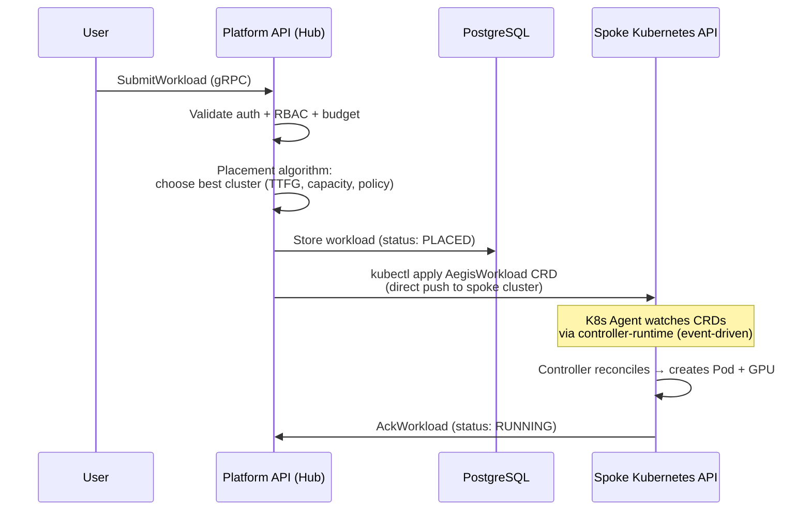

The flow is:
1. Hub receives workload submission
2. Hub runs placement algorithm and **chooses** which spoke cluster gets the work
3. Hub **pushes** an AegisWorkload CRD directly to the spoke cluster's Kubernetes API (using stored kubeconfig or assume-role credentials)
4. K8s Agent on the spoke **watches** for CRDs via controller-runtime (Kubernetes watch = event-driven, not polling)
5. Agent reconciles: creates Pod, attaches GPU, reports back via `AckWorkload` RPC

**The `LeaseWorkload` RPC exists in the proto and server but is never called by the agent.** It's dead code from an earlier design exploration where we considered a pull-based model. The current push-via-CRD approach won out.

#### Should We Use gRPC Streaming Instead of Unary RPCs?

**Short answer: The current unary RPC approach is correct for our architecture. Streaming would help in specific future scenarios but is not needed today.**

Here's the analysis:

| Pattern | Current | With Streaming | Verdict |
|---------|---------|---------------|---------|
| **Heartbeat** (spoke→hub) | Unary RPC every 10s | Bidirectional stream: spoke sends heartbeats on stream, hub sends commands back | **Unary is fine.** 10s intervals are low-frequency. Unary RPCs are simpler to debug, retry, and load-balance. Streaming heartbeats add complexity (stream lifecycle management, reconnection logic) for minimal benefit. |
| **Workload assignment** (hub→spoke) | Hub pushes CRDs directly to spoke K8s API | Server-streaming: hub pushes workload specs over a persistent stream to spoke agent | **CRD push is better for our model.** We push to the Kubernetes API, which gives us CRD reconciliation, retry, and status tracking for free via controller-runtime. A gRPC stream would mean reimplementing what Kubernetes already provides. |
| **Status updates** (spoke→hub) | Unary `AckWorkload` RPC | Client-streaming: spoke streams status updates | **Unary is fine.** Status changes are infrequent (per-workload, not per-second). Individual RPCs are easier to trace in audit logs. |
| **Real-time events** (hub→spoke) | Not implemented | Server-streaming: hub pushes events (config changes, revocations, policy updates) | **This is where streaming would actually help.** Today, if we want to revoke a session or update a policy on a spoke, there's no push channel. The spoke only contacts the hub via heartbeat. A persistent stream would enable real-time commands. |

**Recommendation for the future:** The strongest case for streaming is a **bidirectional command channel** — hub pushes commands (revoke session, terminate workload, update policy) to spokes in real-time, spokes push status updates back. This would replace the current pattern where some operations require the hub to reach the spoke's Kubernetes API directly (which requires stored kubeconfig/credentials).

But this is an optimization, not a correctness issue. The current architecture works and is simpler to operate.

#### How Heartbeat Data Is Managed (and Whether the DB Write Pattern Is Good)

**Current pattern:** Every 10-second heartbeat triggers a PostgreSQL transaction:

```sql
-- Step 1: Update cluster row (1 UPDATE)
UPDATE clusters SET
  ttf_gpu_seconds_p50 = $1,
  proxy_url = COALESCE($2, proxy_url),
  last_heartbeat = NOW(),
  stale_since = NULL,
  updated_at = NOW()
WHERE id = $3 AND deleted_at IS NULL;

-- Step 2: Delete old flavors (1 DELETE)
DELETE FROM cluster_flavors WHERE cluster_id = $1;

-- Step 3: Insert current flavors (N INSERTs, typically 5-10)
INSERT INTO cluster_flavors (cluster_id, flavor) VALUES ($1, $2), ...;
```

**Is this a good pattern?**

| Concern | Assessment |
|---------|-----------|
| **Write volume** | 10 clusters × 1 tx/10s = 1 tx/sec. 100 clusters = 10 tx/sec. PostgreSQL handles 1000s of tx/sec easily. **Not a bottleneck at current scale.** |
| **DELETE + INSERT for flavors** | Simple but wasteful — deletes and re-inserts identical data most of the time. An UPSERT or diff-based approach would reduce writes. **Not a problem today, but worth optimizing at scale.** |
| **Stale detection** | The `last_heartbeat` column is always current because we write on every heartbeat. Stale detection queries use this column. **This is the main reason we write to DB — it's the source of truth for cluster health.** |
| **In-memory alternative** | The memstore (used in local dev) keeps heartbeat state in-memory. For production, the DB write ensures cluster health state survives platform-api restarts. **DB is the right choice for production.** |

**What should be done?**

For current scale (dozens of clusters): **Nothing. The pattern is correct and performant.**

For future scale (hundreds+ of clusters), consider:
1. **Coalesce flavor updates** — Only write flavors if they changed since last heartbeat (compare hash of flavor set). Most heartbeats report the same flavors.
2. **In-memory cache with periodic flush** — Keep `last_heartbeat` in memory, flush to DB every 30-60 seconds instead of every 10s. Stale detection would use in-memory timestamps (slightly less durable but much fewer writes).
3. **Separate heartbeat from capacity reporting** — Heartbeat (health check) could be in-memory only. Capacity/flavor changes could write to DB only when they change.

**Two-phase stale detection (what's actually implemented):**

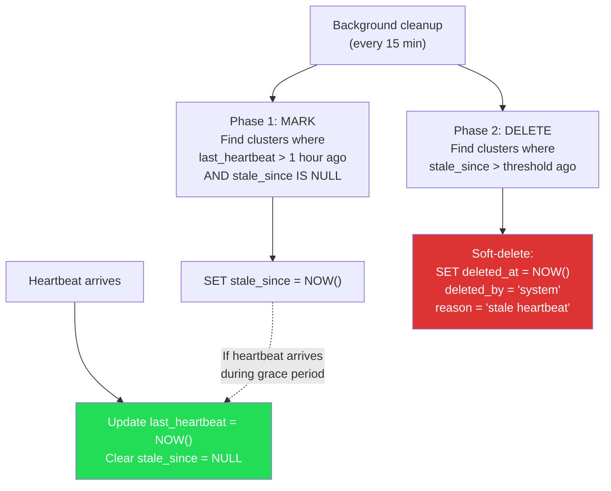

This two-phase approach prevents false positives: if the hub pod restarts and misses heartbeats for a few minutes, clusters get marked stale but aren't deleted until the grace period expires. If the heartbeat resumes, the mark is cleared automatically.

**Key talking point:** "We write heartbeat data to the database because it's the source of truth for cluster health across platform-api restarts. The two-phase stale detection prevents false positives — a cluster isn't removed just because the hub had a brief restart. At our current scale, the write volume is trivial for PostgreSQL. We have a clear optimization path for larger deployments."

---

### "Is the default-deny NetworkPolicy configurable via environment variable or Helm value?"

**Honest answer:** It's controlled by **Helm values** plus a **hardening profile gate**.

In `charts/aegis-services/values/common.yaml`:
```yaml
networkPolicy:
  enabled: true
  defaultDenyAll: true
```

But there's a catch — the NetworkPolicy templates have a **dual condition**:
```yaml
{{- if and .Values.networkPolicy.enabled (ne (default "dev" .Values.hardeningProfile) "dev") }}
```

This means NetworkPolicies are **completely disabled in dev mode** regardless of the `enabled: true` setting. You need both:
1. `networkPolicy.enabled: true`
2. `hardeningProfile` set to something other than `dev` (e.g., `standard`)

Also important: we currently only have **egress** deny-by-default NetworkPolicies. There are no ingress NetworkPolicy templates in the chart yet. The egress policies cover:
- Default deny-all egress for the namespace
- Explicit allow for platform-api egress (DB, DNS, Keycloak)
- Explicit allow for proxy egress

On the spoke side (`charts/aegis-spoke`), the NetworkPolicy for the agent only checks the hardening profile — no separate `enabled` toggle.

**Not configurable via environment variable** — it's purely a Helm values decision.

**How to frame this:** "NetworkPolicies are built into our Helm charts and activated by selecting the `standard` hardening profile. In dev mode they're off for developer convenience. In production you'd deploy with the standard profile, which enables default-deny egress policies. Ingress deny-by-default is on our roadmap."

---

### "For the hybrid (local hub + cloud spoke), why do we need an SSH reverse tunnel if we already have an NLB relay?"

**Important context: This is a development-only topology.** The hybrid setup (local Docker Desktop hub + remote EKS spoke) exists so we can develop and test the full hub-spoke flow without deploying the hub to the cloud. It should not be presented as a production architecture or something customers would ever use.

**Why the SSH tunnel + NLB combo:**

The problem: The spoke's K8s Agent needs to reach the hub's Platform API via gRPC. But the hub is running on your laptop (Docker Desktop). Your laptop is behind NAT — it has no public IP that the cloud spoke can reach.

The solution is two pieces working together:

1. **SSH reverse tunnel** — From your laptop, you SSH to an EC2 instance in AWS and set up a reverse port forward. This makes your laptop's port 8081 (gRPC) and port 8443 (Keycloak OIDC) reachable from inside the AWS VPC via the EC2 instance.

2. **NLB (Network Load Balancer)** — The NLB sits in front of the EC2 instance and provides a stable DNS endpoint. The spoke's K8s Agent is configured to connect to the NLB's DNS name. The NLB does TCP passthrough (no TLS termination) so mTLS is preserved end-to-end.

```
Spoke Agent → NLB (TCP passthrough) → EC2 (SSH tunnel endpoint) → Your Laptop (Docker Desktop)
```

**Why not just the SSH tunnel?** The NLB gives you a stable DNS name and health checks. Without it, you'd need to put the EC2's private IP directly in the spoke's Helm values, and if the EC2 instance changes, you'd have to reconfigure.

**Why not just the NLB?** The NLB can only route to targets inside AWS. Your laptop isn't in AWS. The SSH tunnel bridges the gap.

**Key line for customers:** "This is our local development setup — it lets a single developer run the full hub-spoke flow for testing. In production, the hub runs on EKS alongside the spokes, and spokes connect directly to the Platform API's LoadBalancer service. No tunnels, no relays."

---

### "Does the UI have to communicate with Platform API through the Backstage proxy backend? Is this necessary? Is it a security requirement?"

**Answer:** Yes, the Backstage proxy backend is required, but it's primarily an **architectural consequence of how Backstage works**, not a security-driven decision.

**Why the proxy is required:**

1. **Browser CORS policy** — The Backstage frontend (React, running on `localhost:3000` or `ui.aegis-platform.tech`) cannot make direct API calls to Platform API (running on a different origin/port) due to browser same-origin policy. The proxy backend runs on the same origin as the frontend, so it can forward requests without CORS issues.

2. **How Backstage is built** — Backstage's plugin architecture expects backend plugins to handle external API communication. The `@backstage/plugin-proxy-backend` is a standard Backstage pattern. All Backstage plugins that talk to external APIs use this pattern — it's not Aegis-specific.

3. **Header forwarding** — The proxy forwards the Keycloak JWT in the `Authorization` header and adds `Grpc-Metadata-Authorization` for gRPC-Web compatibility. This is configured in `app-config.yaml`.

**Is there a security benefit?** Incidentally, yes:
- The proxy backend acts as a single egress point from the UI to the API, which is easier to audit and monitor
- The `allowedHeaders` configuration limits which headers are forwarded (only `Authorization` and `Grpc-Metadata-Authorization`)
- Credentials forwarding is explicit (`credentials: forward` in production config)

But the honest answer is: **we use the proxy because Backstage requires it for any external API integration, and CORS makes direct browser-to-API calls impractical.** If we had built a custom frontend instead of using Backstage, we could have set up CORS headers on Platform API and skipped the proxy. The security benefit is a side effect, not the driver.

**How to frame this:** "The UI uses Backstage's standard proxy backend for API calls. This is how Backstage handles external API communication — it's a well-established pattern. The proxy forwards authentication tokens and provides a single auditable egress point from the UI to our control plane API."

---

### "Can we run this on bare metal / RKE2 / non-EKS?"

**Answer:** The platform runs on any Kubernetes distribution. We've tested on:
- Docker Desktop (local development)
- EKS (production cloud)

RKE2 and k3s are on the testing roadmap. The Helm charts are distribution-agnostic — the only EKS-specific components are in the Terraform directory (for infrastructure provisioning). The platform itself is pure Kubernetes.

### "What about GPU scheduling fairness?"

**Answer:** We have Kueue integration built in the K8s Agent controller. The full implementation exists — workloads can be queued with priority classes and fair-sharing policies. The remaining work is exposing the Kueue configuration through Helm values (~1 day of work).

Additionally, our budget enforcement (HARD mode) prevents any single project from consuming more than its allocated budget, which serves as a financial fairness mechanism.

---

## Appendix A: Key Terminology

| Term | Definition |
|------|-----------|
| **Hub** | Central control plane cluster running Platform API, Keycloak, UI, Proxy, PostgreSQL |
| **Spoke** | Remote GPU cluster running K8s Agent and Spoke Proxy. Executes workloads. |
| **Workload** | User-submitted compute job: either a Workspace (interactive) or Training (batch) |
| **AegisWorkload** | Custom Resource Definition (CRD) representing a workload in a spoke cluster |
| **TTFG** | Time-to-First-GPU — p50 latency from submission to GPU attachment |
| **PolicyDomain** | Project-level policy: allowed regions, data classification (IL-1 to IL-5) |
| **Flavor** | GPU type definition (e.g., A100-40GB, H100-80GB) with resource requests |
| **Proxy Ticket** | Short-lived JWT (5-min max) issued for workspace WebSocket connection |
| **ATO** | Authority to Operate — formal authorization to run a system in a regulated environment |
| **SSP** | System Security Plan — documentation of security controls for ATO package |
| **CUI** | Controlled Unclassified Information — sensitive but not classified data |
| **FIPS** | Federal Information Processing Standards — required cryptographic standards for federal systems |
| **mTLS** | Mutual TLS — both client and server present certificates for authentication |
| **PKCE** | Proof Key for Code Exchange — OAuth extension preventing authorization code interception |
| **AMR** | Authentication Methods Reference — JWT claim listing authentication factors used |
| **JTI** | JWT ID — unique identifier enabling one-time-use token enforcement |

## Appendix B: Quick Reference — What We Have vs. What We're Building

```
BUILT (in production code today):
  Auth:      OIDC/PKCE, MFA enforcement, RBAC (fail-closed), session tokens
  Crypto:    TLS 1.2+, mTLS (hub-side), internal PKI
  Network:   Default-deny egress NetworkPolicy (standard profile), outbound-only spokes, per-project NS
  Audit:     Structured JSON logging, Prometheus metrics
  Compute:   Multi-cluster scheduling, budget enforcement, workspace + batch
  UI:        23+ page Backstage app
  Infra:     Helm charts, Terraform IaC

BUILDING (concrete plans, partial code exists):
  FIPS 140-3:  BoringCrypto build, UBI9 FIPS images (2-4 weeks)
  Full mTLS:   Spoke client cert loading (1-2 weeks)
  PIV/CAC:     AMR claim mapper, DoD auth flow (1 week)
  Audit UI:    Wire existing component to API (3-5 days)
  Compliance:  Productize documentation as deliverables (3+ weeks)

FUTURE (planned, no code yet):
  FedRAMP LI-SaaS assessment
  Platform One / Iron Bank integration
  Bare metal (RKE2) certified testing
```
