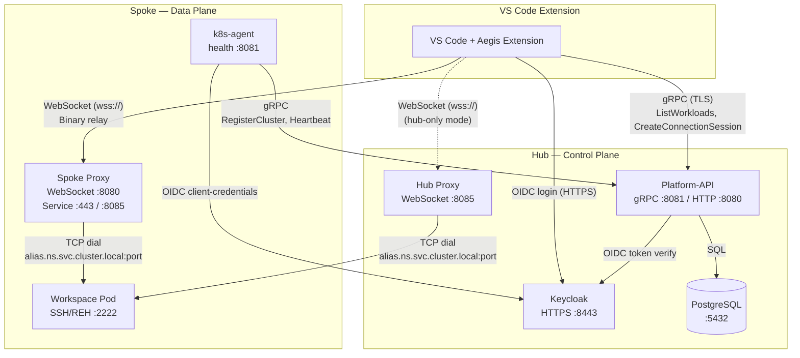
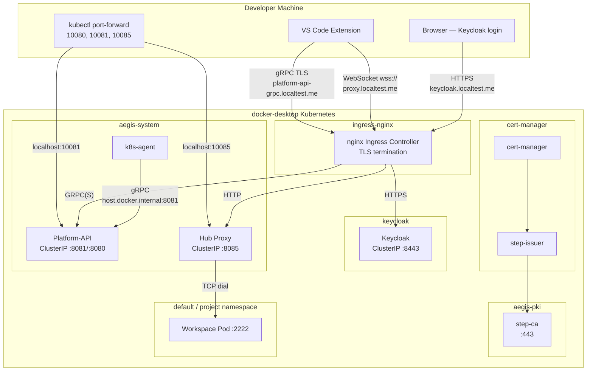
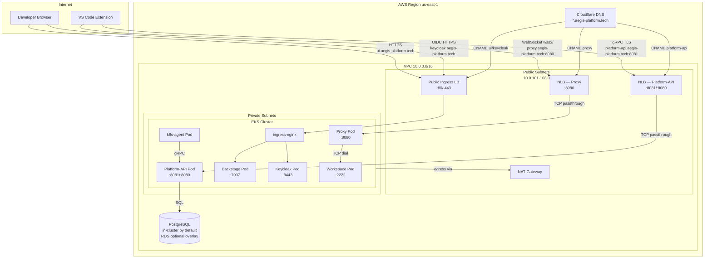
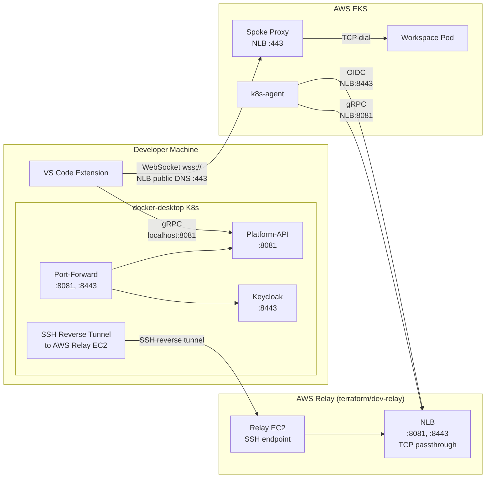
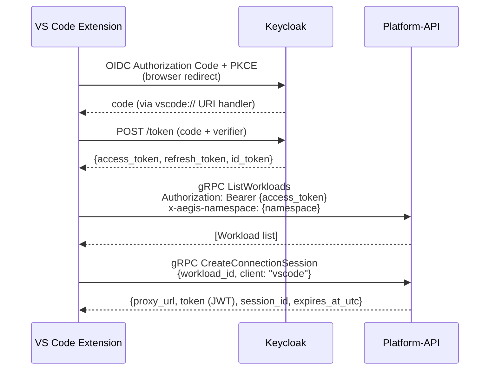
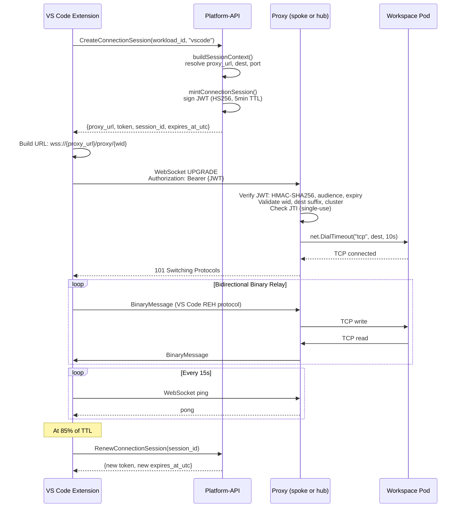
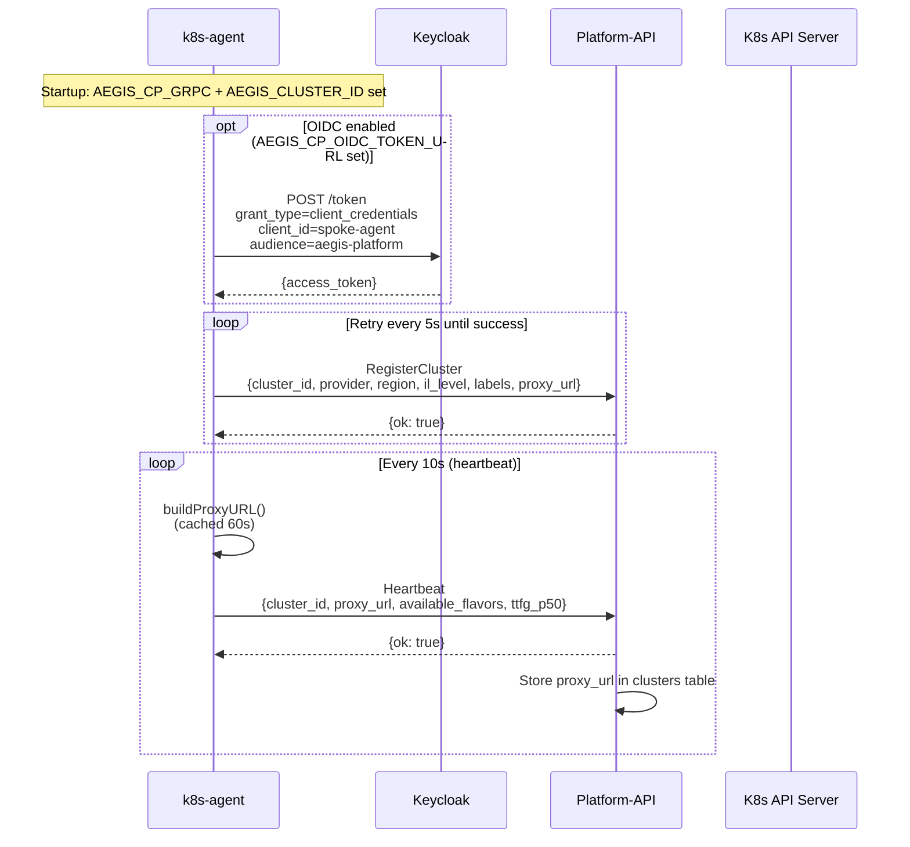
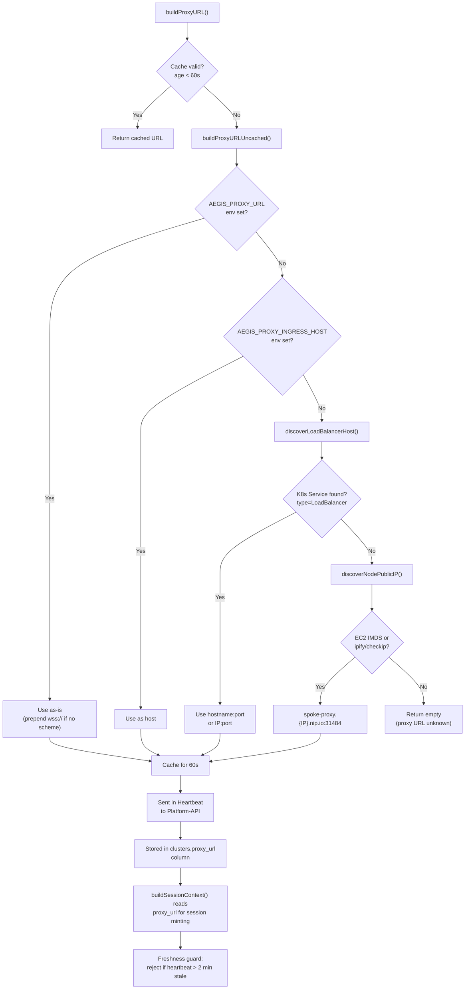
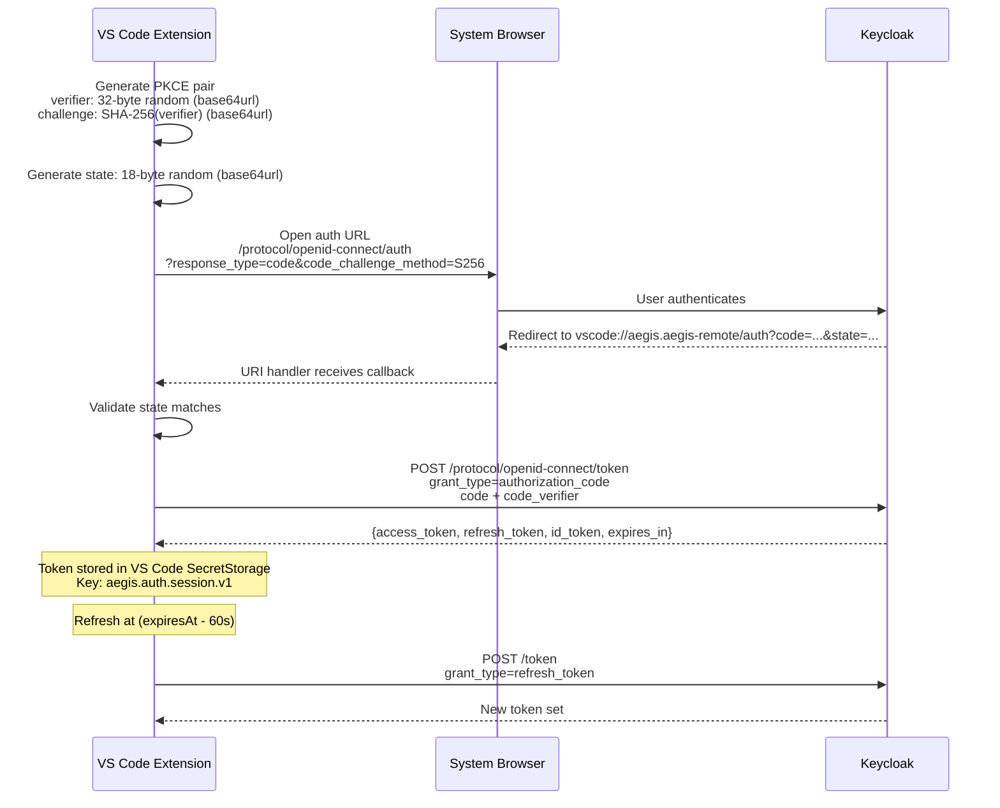
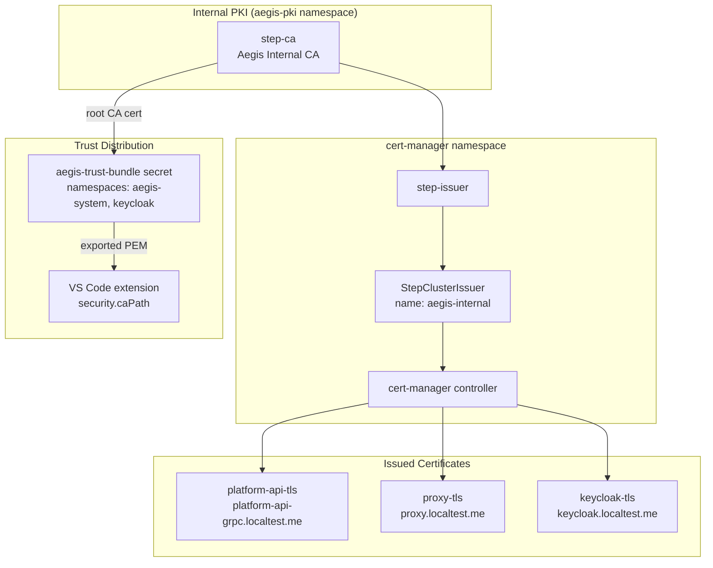

# Aegis Platform — Networking Architecture

> **Authoritative for** network topology, ports, protocols, certificate paths, and DNS relationships.
> **Not authoritative for** deployment workflow or command sequencing; use `AGENT_DEPLOYMENT_GUIDE.md` for rollout steps.
> Diagrams use **Mermaid** syntax (compile on [mermaidchart.ai](https://www.mermaidchart.com)).

---

## Table of Contents

1. [Overview & Network Topology](#1-overview--network-topology)
2. [Why Outbound-Only Spoke Architecture](#2-why-outbound-only-spoke-architecture)
3. [Zero-Trust Security Model](#3-zero-trust-security-model)
4. [Component Inventory](#4-component-inventory)
5. [Deployment Model Networking](#5-deployment-model-networking)
   - 5a. [Local Dev (TLS)](#5a-local-dev-tls)
   - 5b. [Cloud (AWS EKS)](#5b-cloud-aws-eks)
   - 5c. [Hybrid (local hub + cloud spoke)](#5c-hybrid-local-hub--cloud-spoke)
6. [Connection Flows](#6-connection-flows)
   - 6a. [VS Code → Platform-API (control plane)](#6a-vs-code--platform-api-control-plane)
   - 6b. [VS Code → Proxy → Workspace (data plane)](#6b-vs-code--proxy--workspace-data-plane)
   - 6c. [k8s-agent → Platform-API (spoke registration)](#6c-k8s-agent--platform-api-spoke-registration)
   - 6d. [Proxy URL Discovery](#6d-proxy-url-discovery)
7. [Authentication & Authorization](#7-authentication--authorization)
8. [TLS & Certificate Management](#8-tls--certificate-management)
9. [DNS & Service Discovery](#9-dns--service-discovery)
10. [Cloudflare Tunnels (Historical)](#10-cloudflare-tunnels-historical)
11. [AWS Infrastructure Networking](#11-aws-infrastructure-networking)
12. [Helm Values → Networking Component Map](#12-helm-values--networking-component-map)
13. [Port Reference Table](#13-port-reference-table)
14. [Environment Variable Reference](#14-environment-variable-reference)
15. [Troubleshooting](#15-troubleshooting)

---

## 1. Overview & Network Topology

Aegis follows a **hub-and-spoke** architecture:

| Role | Component | Responsibility |
|------|-----------|----------------|
| **Hub** | Platform-API | Control plane — session management, workload scheduling, cluster registry |
| **Spoke** | k8s-agent + Proxy | Data plane — workload execution, WebSocket tunneling |
| **Client** | VS Code extension | Developer interface — gRPC control plane + WebSocket data plane |

Two deployment models are supported — **Local Dev (TLS)** and **Cloud (EKS)** — plus a
**Hybrid** variant (local hub + cloud spoke).

### Fig 1 — High-Level Hub-and-Spoke Architecture



---

## 2. Why Outbound-Only Spoke Architecture

This is one of the most important architectural decisions in Aegis and a key differentiator against every competitor in the market. Most people who haven't deployed into regulated environments don't realize how significant it is.

### The Problem It Solves

When a DoD program office or contractor wants to connect a remote GPU cluster (a spoke) to a central control plane (the hub), the first question their network security team asks is:

> "What inbound firewall rules do we need to open?"

With every other platform (Run:ai, Domino, Kubeflow, HPE MLDE), the answer is some version of: "You need to allow inbound traffic on ports X, Y, Z to reach our agents/services." That triggers a **months-long process**:

1. **Network change request** — reviewed by the network security team
2. **Risk assessment** — what's the blast radius if this port is compromised?
3. **ATO impact assessment** — does opening inbound ports change the system's authorization boundary?
4. **Firewall rule implementation** — coordinated across multiple teams
5. **Continuous monitoring** — new inbound rules need ongoing justification

In classified or CUI environments, opening inbound ports on a network boundary is treated as a **material change to the security posture**. It can trigger a partial or full ATO reassessment.

### How Aegis Eliminates This Problem

With Aegis, the spoke cluster initiates **all** connections. The k8s-agent makes an outbound gRPC call to the hub. The spoke proxy makes an outbound WebSocket connection. The hub never reaches into the spoke.

| Scenario | Traditional Platform | Aegis |
|---|---|---|
| **Firewall rules on spoke network** | Inbound rules required (ports for API, agent, monitoring) | **Zero inbound rules** — only standard outbound HTTPS (443) |
| **Network change request** | Required — weeks to months | **Not required** — outbound HTTPS is already allowed on virtually every network |
| **ATO impact** | Opening inbound ports = potential ATO reassessment | **No change to network boundary** — outbound HTTPS is already in the baseline |
| **Air-gapped sites** | Complex — need VPN, bastion hosts, or relay infrastructure for inbound | Works naturally — spoke calls out when connectivity exists, operates autonomously when it doesn't |
| **Multi-site deployment** | Each site needs firewall changes = multiply the approval process by N sites | Each site just deploys the spoke Helm chart — **no network team involvement** |

### Why This Matters for Multi-Site Deployments

Imagine deploying to 5 DoD sites. With inbound port requirements, you need:
- 5 separate network change requests
- 5 separate security reviews
- 5 different network teams to coordinate with
- 5 different firewall rule sets to maintain

With Aegis, you need:
- 5 Helm installs. The spoke calls out. Done.

### The Security Argument

Outbound-only is also a stronger security posture. An inbound port is an attack surface — it's a door that someone can try to open from the outside. Outbound-only means there's **no door to attack**. The spoke decides when to connect, what to send, and can disconnect at any time. If the hub is compromised, it can't reach into spokes — it can only respond to connections spokes initiate.

**This is not just a technical feature — it's a procurement accelerator.** It turns a months-long network approval process into a same-day deployment at every site.

### How It Works in Practice

```
Spoke network (customer-managed, no inbound rules):
  k8s-agent  ──outbound gRPC──►  Hub Platform-API (RegisterCluster, Heartbeat)
  k8s-agent  ──outbound HTTPS──►  Hub Keycloak (OIDC client credentials)
  spoke-proxy ──outbound WSS──►  Hub Proxy (workspace tunnel relay, if hub-relay mode)

Hub network (control plane):
  Listens on :8081 (gRPC), :8443 (OIDC), :8080 (HTTP), :8085 (WebSocket)
  Accepts inbound connections from authenticated spokes only (mTLS + OIDC)
  Never initiates connections TO spokes
```

The spoke agent heartbeats every 10 seconds. If the hub is unreachable, the spoke continues executing existing workloads autonomously. When connectivity resumes, the agent reconnects and syncs state. No data is lost.

---

## 3. Zero-Trust Security Model

Aegis uses a **zero-trust architecture with cryptographic verification** at every layer. This is fundamentally different from the traditional network-perimeter model used in most regulated environments.

### Network Perimeter vs. Zero-Trust

Traditional CUI environments (AWS Workspaces + Transit Gateway + Network Firewall) rely on **network-level isolation**: VPC boundaries, firewall rules, and route tables. Security depends on correctly configuring network rules. A misconfigured firewall rule can expose the entire boundary.

Aegis verifies every connection cryptographically. Security does not depend on network boundaries — it works on any network, including the public internet.

```
Traditional network perimeter model:
  ┌──────────────────────────────────┐
  │  Firewall / TGW (single gate)   │  ← if this fails, everything inside is exposed
  │  ┌────────────────────────────┐  │
  │  │  Everything is trusted     │  │
  │  │  once you're inside        │  │
  │  └────────────────────────────┘  │
  └──────────────────────────────────┘

Aegis zero-trust model:
  Every request must pass ALL gates independently:
  [mTLS cert] → [OIDC token] → [RBAC check] → [session token] → [namespace policy]
       ↑              ↑              ↑              ↑              ↑
  Each layer is independent. Compromising one doesn't bypass the others.
```

### Defense-in-Depth Layers

| Layer | What It Does | What It Prevents | Failure Mode |
|---|---|---|---|
| **mTLS** | Both sides present certificates — spoke proves identity to hub, hub proves identity to spoke | Man-in-the-middle, spoofed spokes, unauthorized hubs | Missing cert = connection refused (fail-closed) |
| **OIDC PKCE** | Authorization code flow with proof key — no credentials exposed in redirects | Token interception, authorization code replay | Invalid PKCE = auth denied |
| **Single-use JWT** | 5-minute TTL, JTI tracking — each token works exactly once | Token replay, session hijacking, stolen credential reuse | Reused token = rejected |
| **RBAC (fail-closed)** | Every API call checked against project membership and role bindings | Unauthorized access, privilege escalation | No binding = denied |
| **Namespace isolation** | Each project's workloads run in a separate Kubernetes namespace with NetworkPolicy | Lateral movement between tenants | Cross-namespace traffic blocked by default |
| **Sovran secure mode** | RAM-disk for CUI data, ephemeral tokens, FDE verification on endpoint | Data at rest on endpoint, credential persistence on disk | No FDE = launch refused |

**Key property:** These layers are independent. Compromising the network doesn't give you a valid mTLS certificate. Stealing a certificate doesn't give you an OIDC token. Getting an OIDC token doesn't bypass namespace isolation. **No single control failure creates a cross-tenant incident.**

### Comparison: Network Isolation vs. Cryptographic Isolation

| Property | Network Perimeter (VPC/TGW/NFW) | Zero-Trust (Aegis) |
|----------|--------------------------------|---------------------|
| **Failure mode** | Misconfigured firewall = breach (fail-open) | Missing certificate = connection refused (fail-closed) |
| **Lateral movement** | Depends on correct network segmentation across all VPCs | mTLS + namespace isolation + RBAC — any single layer can fail and others hold |
| **CUI on endpoint** | Data stays inside VM boundary (no local persistence) | Sovran secure mode: RAM-disk + FDE verification + ephemeral tokens |
| **Auditability** | VPC Flow Logs + CloudTrail (network-level) | Structured JSON audit events per request with subject, action, resource, outcome (application-level) |
| **Infrastructure dependency** | Requires Transit Gateway, Network Firewall, VPC Endpoints, Microsoft AD | Runs on any Kubernetes cluster — no specific cloud infrastructure required |
| **Multi-cloud / on-prem** | AWS-only (TGW, NFW are AWS services) | Any Kubernetes distribution on any infrastructure |

### Understanding the Three Environments Aegis Operates In

There are three distinct deployment environments in regulated computing, and they are frequently confused. Getting this distinction right is critical for positioning and for honest conversations with ISSMs, ISSOs, and program security officers.

| Environment | What It Actually Is | Examples | Aegis Value |
|---|---|---|---|
| **True air-gap** | Physically disconnected. No wire connects to the outside. You walk into a facility, sit at a terminal. No internet, no VPN, no external connectivity. | TS/SCI SCIFs, submarine networks, JWICS, tactical edge | Aegis provides GPU scheduling, workspaces, multi-tenancy, and audit logging inside the boundary. Hub and spokes all run inside the air-gapped network. DX improvement is smaller because the user is already physically inside. |
| **Simulated air-gap** | Network-connected but heavily restricted. Multiple VPCs, firewalls, Transit Gateway, Network Firewall — engineers access via VPN or Workspaces VM. Data doesn't leave the boundary, but there IS connectivity between components. | CUI/IL-4/IL-5 contractor environments, most DoD unclassified-but-regulated setups, the NTConcepts-style architecture (AWS Workspaces + TGW + NFW + Kubeflow) | **This is where Aegis delivers the most value.** Replaces months of TGW/NFW/AD/Workspaces infrastructure assembly with Helm-deployed hub-and-spoke. Same security posture through cryptographic controls instead of network infrastructure. Dramatically better DX (VS Code instead of VM hop). |
| **Connected/regulated** | Cloud infrastructure with security controls but not air-gapped. Standard compliance frameworks (FedRAMP, HIPAA). | Commercial regulated, FedRAMP environments | Aegis provides multi-cluster GPU orchestration with built-in compliance controls. |

**The critical insight:** Most DoD CUI/IL-4/IL-5 environments are **simulated air-gaps**, not true air-gaps. True air-gaps are reserved for classified (TS/SCI) and tactical edge. The vast majority of contracts and departments that say they want "air-gapped security" actually want the security posture of an air-gap — controlled access, no data exfiltration, full audit trail — without physically disconnecting from the network.

**Aegis targets the simulated air-gap market — which is 90%+ of the DoD CUI/IL-4/IL-5 market.** These organizations today spend months assembling Transit Gateway routing, Network Firewall inspection, AWS Workspaces, and Kubeflow to achieve simulated air-gap security. Their engineers hate the experience (remote VM, browser-based Jupyter, multiple network hops). Aegis gives them the same security outcome through cryptographic controls, deployable in days, with native VS Code instead of a Workspaces VM.

**Aegis does NOT claim to replace true air-gaps.** For TS/SCI environments where the requirement is "no data can leave this physical facility," physical disconnection is the only answer. Aegis can deploy inside a true air-gapped network (spoke runs autonomously, images delivered via content drop), but the user must be physically inside that network. The primary value proposition — eliminating the VM hop and infrastructure complexity — applies to simulated air-gaps, not true air-gaps.

**How to frame this in customer conversations:**

> "Your team wants air-gapped-level security for their CUI/ML environment. Today that means 6 months of Transit Gateway, Network Firewall, Workspaces, and Kubeflow assembly — and your engineers hate using it. Aegis gives you the same security controls in a week, and your engineers get to use VS Code instead of a remote VM. For truly classified environments, Aegis deploys inside the boundary too — but the big win is for the CUI/IL-4/IL-5 environments where you're building simulated air-gaps from infrastructure primitives today."

---

## 4. Component Inventory

| Component | Container Port(s) | K8s Service Port(s) | Protocol | Service Type | Direction |
|-----------|-------------------|---------------------|----------|-------------|-----------|
| Platform-API | `8081` (gRPC), `8080` (HTTP) | `8081`, `8080` | gRPC/HTTP2, HTTP/REST | ClusterIP (local) / LoadBalancer (cloud) | Inbound |
| Hub Proxy | `8080` | `8085` | WebSocket | ClusterIP + Ingress | Inbound |
| Spoke Proxy | `8080` | `443` (cloud) / `8085` (local) | WebSocket/TLS | LoadBalancer (cloud) / ClusterIP (local) | Inbound |
| Keycloak | `8443` | `8443` | HTTPS | ClusterIP + Ingress | Inbound |
| PostgreSQL | `5432` | `5432` | TCP | ClusterIP (local) / RDS (cloud) | Internal |
| k8s-agent | `8081` (health) | — | HTTP (healthz/readyz) | — | Outbound-only gRPC client |
| VS Code extension | — | — | gRPC + WebSocket | — | Outbound-only |

---

## 5. Deployment Model Networking

### 5a. Local Dev (TLS)

All services run on **docker-desktop** Kubernetes. TLS is always enabled via cert-manager + step-ca.

**PKI stack** (installed via `scripts/install-internal-pki.sh`):

| Component | Helm Chart | Namespace |
|-----------|-----------|-----------|
| cert-manager | `jetstack/cert-manager` | `cert-manager` |
| step-ca | `smallstep/step-certificates` | `aegis-pki` |
| step-issuer | `smallstep/step-issuer` | `cert-manager` |

- **StepClusterIssuer** name: `aegis-internal` (kind: `StepClusterIssuer`, group: `certmanager.step.sm`)
- Certificate duration: `2160h` (90 days), renewBefore: `168h` (7 days)
- Trust bundle: secret `aegis-trust-bundle` in `aegis-system` and `keycloak` namespaces (keys: `ca.crt`, `aegis-local-trust.pem`)
- VS Code extension requires `aegisRemote.security.caPath` pointing to exported CA

**Service exposure:**

- All services are **ClusterIP**
- `kubectl port-forward` maps to localhost:
  - Platform-API gRPC: `localhost:10081` → `8081`
  - Platform-API HTTP: `localhost:10080` → `8080`
  - Spoke Proxy: `localhost:10085` → `8085`
- **nginx ingress** handles TLS termination and routing
- k8s-agent connects to `host.docker.internal:8081`
- Proxy accessed via nginx ingress at `proxy.localtest.me`

### Fig 2 — Local Dev (TLS) Network Topology



**Helm values driving local networking** (`aegis-spoke/values.yaml` + `aegis-services/values/local.yaml`):

| Helm Value | Value | Effect |
|------------|-------|--------|
| `proxy.service.type` | `ClusterIP` | No external LB |
| `proxy.ingress.enabled` | `true` | Nginx routes `proxy.localtest.me` |
| `proxy.ingress.hostname` | `proxy.localtest.me` | Sets `AEGIS_PROXY_INGRESS_HOST` |
| `k8sAgent.env.AEGIS_CP_GRPC` | `host.docker.internal:8081` | Agent reaches host-network API |
| `platformApi.service.type` | `ClusterIP` | Internal only |
| `platformApi.ingress.enabled` | `true` | Nginx routes `platform-api-grpc.localtest.me` |

---

### 5b. Cloud (AWS EKS)

In the current full-cloud workflow, public DNS is managed through Cloudflare on `*.aegis-platform.tech`.
`platform-api` and `proxy` are exposed on direct public service load balancers, while `ui` and
`keycloak` share the public ingress load balancer.

### Fig 3 — Cloud (EKS) Network Topology



**Key infrastructure details:**

- **VPC**: `10.0.0.0/16`, 3 AZs (`us-east-1a/b/c`)
  - Public subnets: `10.0.101.0/24`, `10.0.102.0/24`, `10.0.103.0/24`
  - Private subnets: `10.0.1.0/24`, `10.0.2.0/24`, `10.0.3.0/24`
  - Database subnets: `10.0.201.0/24`, `10.0.202.0/24`, `10.0.203.0/24`
- **NAT Gateway**: single (cost-optimized), shared across all private subnets
- **NLB (Platform-API)**: internet-facing, TCP passthrough on `8081`/`8080`
- **NLB (Proxy)**: internet-facing, TCP passthrough on `8080`
- **Public ingress LB**: internet-facing ingress-nginx service for `ui` and `keycloak`
- **Cloudflare DNS**: canonical `*.aegis-platform.tech` CNAME records to the current public load balancers
- **PostgreSQL**: in-cluster by default for the minimal cloud hub; RDS remains an overlay for fuller production setups

**Helm values driving cloud networking** (`aegis-spoke/values-cloud-remote.yaml` + `aegis-services/values/cloud.yaml`):

| Helm Value | Value | Effect |
|------------|-------|--------|
| `platformApi.service.type` | `LoadBalancer` | Direct public service endpoint for platform-api |
| `proxy.service.type` | `LoadBalancer` | Direct public service endpoint for proxy |
| `proxy.service.port` | `8080` | Public WebSocket/TLS port |
| `backstage.ingress.enabled` | `true` | Shared public ingress for UI |
| `keycloak.instance.hostname` | `https://keycloak.aegis-platform.tech` | Public Keycloak hostname |
| `k8sAgent.env.AEGIS_CP_GRPC` | `<nlb-dns>:8081` | Agent reaches hub via NLB |
| `k8sAgent.env.AEGIS_CP_GRPC_INSECURE` | `"false"` | TLS enabled |
| `k8sAgent.env.AEGIS_CP_OIDC_TOKEN_URL` | Keycloak token endpoint | Client-credentials auth |

---

### 5c. Hybrid (local hub + cloud spoke)

Platform-API runs on docker-desktop (`localhost:8081`). Spoke cluster runs on EKS. All traffic routes through a single AWS NLB relay via SSH reverse tunnel:

| Traffic | Route | Why |
|---------|-------|-----|
| gRPC (platform-api) | AWS NLB :8081 → SSH tunnel → local :8081 | TCP passthrough preserves HTTP/2 |
| OIDC (Keycloak) | AWS NLB :8443 → SSH tunnel → local :8443 | TCP passthrough, no extra dependencies |

### Fig 3c — Hybrid Topology



**Setup:** Run `./scripts/start-aws-tunnel.sh` to establish the tunnel. See `docs/aws-tunnel-dev-setup.md` for full guide.

---

## 6. Connection Flows

### 6a. VS Code → Platform-API (control plane)

### Fig 4a — Control Plane gRPC Flow



**Extension settings:**

| Setting | Purpose |
|---------|---------|
| `aegisRemote.platform.grpcEndpoint` | Platform-API `host:port` |
| `aegisRemote.auth.authority` | Keycloak issuer URL |
| `aegisRemote.auth.clientId` | OAuth2 client ID |
| `aegisRemote.auth.scopes` | `["openid", "profile", "email", "offline_access"]` |
| `aegisRemote.platform.authScope` | Audience: `"aegis-platform"` |

**gRPC channel configuration:**

- Localhost/`127.0.0.1`: insecure credentials
- Remote: `grpc.credentials.createSsl(combinedCABuffer)` — system roots + custom CA
- Channel options: `max_receive_message_length: 10MB`, `ssl_target_name_override`, `default_authority`
- Deadline: `30s` for `CreateConnectionSession` / `RenewConnectionSession`, `10s` for `RevokeConnectionSession`
- Auto-retry: on `UNAUTHENTICATED` status, re-authenticates once then retries

**RPCs used:**

| RPC | HTTP Gateway | Purpose |
|-----|-------------|---------|
| `ListWorkloads` | `GET /api/v1/projects/{id}/workloads` | List available workspaces |
| `CreateConnectionSession` | `POST /api/v1/connection_sessions` | Mint a proxy ticket |
| `RenewConnectionSession` | `POST /api/v1/connection_sessions/{id}/renew` | Extend session before expiry |
| `RevokeConnectionSession` | `POST /api/v1/connection_sessions/{id}/revoke` | Tear down on disconnect |

---

### 6b. VS Code → Proxy → Workspace (data plane)

### Fig 4b — Data Plane WebSocket Flow



**Key parameters:**

| Parameter | Value | Source |
|-----------|-------|--------|
| JWT algorithm | HS256 (HMAC-SHA256) | `jwt.SigningMethodHS256` |
| JWT audience | `aegis-proxy` | `AEGIS_PROXY_EXPECTED_AUDIENCE` |
| JWT TTL | 5 min (default 300s, hard-capped at 5 min) | `connectionTokenTTL()` |
| JTI format | `jti-{16 hex chars}` | `mintConnectionSession()` |
| JTI reuse window | 600s (10 min) | `AEGIS_PROXY_JTI_TTL_SECONDS` |
| Dest suffix | `.svc.cluster.local` | `AEGIS_PROXY_ALLOWED_SUFFIX` |
| Upstream dial timeout | 10s | `net.DialTimeout` |
| WebSocket ping interval | 15s (configurable, min 1s) | `aegisRemote.heartbeatIntervalMs` |
| Client idle timeout | 45s (configurable) | `aegisRemote.idleTimeoutMs` |
| Proxy standard session timeout | 15 min | `AEGIS_PROXY_STANDARD_TIMEOUT` |
| Proxy privileged session timeout | 10 min | `AEGIS_PROXY_PRIVILEGED_TIMEOUT` |
| Token renewal | At 85% of TTL (min 5s before expiry) | `resolver.ts scheduleRenewal()` |

**Proxy JWT claims:**

```json
{
  "sub": "<user-email>",
  "wid": "<workload-id>",
  "dest": "<alias>.<namespace>.svc.cluster.local:<port>",
  "dns": "<alias>.<namespace>.svc.cluster.local",
  "cluster": "<cluster-id>",
  "one_time": true,
  "jti": "jti-<hex>",
  "aud": ["aegis-proxy"],
  "exp": "<unix-timestamp>",
  "iat": "<unix-timestamp>",
  "nbf": "<unix-timestamp>"
}
```

---

### 6c. k8s-agent → Platform-API (spoke registration)

### Fig 5 — Agent Registration & Heartbeat



**Timing constants:**

| Constant | Value | Location |
|----------|-------|----------|
| Registration retry | 5s | `aegisworkload_controller.go` |
| Heartbeat interval | 10s | `cpclient/client.go` |
| Proxy URL cache TTL | 60s | `aegisworkload_controller.go` |
| OIDC HTTP timeout | 15s | `cpclient/client.go` |
| LB discovery timeout | 5s | `aegisworkload_controller.go` |
| AWS IMDS timeout | 2s | `aegisworkload_controller.go` |
| Heartbeat freshness guard | 2 min | `buildSessionContext()` |

**gRPC TLS configuration:**

- TLS enabled when `AEGIS_CP_GRPC_INSECURE=false` (case-insensitive)
- CA resolution priority: `AEGIS_PLATFORM_CA_B64` → `AEGIS_PLATFORM_CA_PEM` → `AEGIS_PLATFORM_CA_FILE`
- Server name: `AEGIS_CP_GRPC_SERVER_NAME` or derived from endpoint
- Token cached via `oauth2.ReuseTokenSource` (auto-refresh on expiry)

---

### 6d. Proxy URL Discovery

The k8s-agent discovers the spoke proxy URL and reports it to the hub via heartbeat. The hub stores it in the `clusters.proxy_url` column and reads it back when minting connection sessions.

### Fig 6 — Proxy URL Discovery Chain



**`discoverLoadBalancerHost()` details:**

- Probes service names: `aegis-spoke-proxy`, `spoke-proxy`
- In namespaces: `aegis-system`, `default`
- Port selection: named `proxy` or `https`, or numbered `8443`/`31484`; falls back to `31484`
- Returns `hostname:port` (AWS) or `IP:port` (GCP/Azure)

**`discoverNodePublicIP()` fallback chain:**

1. AWS EC2 IMDSv1: `http://169.254.169.254/latest/meta-data/public-ipv4` (2s timeout)
2. `https://api.ipify.org` (3s timeout)
3. `https://checkip.amazonaws.com` (3s timeout)
4. `https://ifconfig.me/ip` (3s timeout)

---

## 7. Authentication & Authorization

### 7a. User auth (VS Code → Keycloak → Platform-API)

### Fig 7a — User OIDC Flow



| Parameter | Value |
|-----------|-------|
| Keycloak realm | `aegis` |
| Client ID | `vscode-extension` (public client) |
| Redirect URI | `vscode://aegis.aegis-remote/auth` |
| Scopes | `openid profile email offline_access` + `aegis-platform` (audience) |
| Login timeout | 120s |
| Refresh skew | 60s before expiry |
| PKCE verifier | 32-byte `crypto.randomBytes`, base64url |
| State | 18-byte random, base64url |

**Automation/CI:** Set `AEGIS_TEST_USERNAME` + `AEGIS_TEST_PASSWORD` env vars for direct `password` grant (bypasses browser).

### 7b. Agent auth (k8s-agent → Keycloak → Platform-API)

| Parameter | Value |
|-----------|-------|
| Grant type | `client_credentials` |
| Client ID | `spoke-agent` |
| Audience | `aegis-platform` |
| Auth style | `oauth2.AuthStyleInParams` (form body) |
| Token caching | `oauth2.ReuseTokenSource` (auto-refresh) |
| OIDC CA resolution | `AEGIS_CP_OIDC_CA_B64` → `AEGIS_CP_OIDC_CA_FILE` → gRPC CA chain |

### 7c. Proxy auth (JWT-based)

| Parameter | Value |
|-----------|-------|
| Algorithm | HS256 (HMAC-SHA256) |
| Shared secret env | `AEGIS_PROXY_JWT_SECRET` (must match on Platform-API and Proxy) |
| Audience | `aegis-proxy` |
| TTL | 5 min (configurable via `AEGIS_PROXY_TOKEN_TTL_SECONDS`, capped at 5 min) |
| One-time use | JTI tracked in proxy in-memory store (TTL: 600s) |
| Claims validated | `wid`, `dest`, `dns`, `jti`, `aud`, `exp`, signing method, dest suffix, cluster |

---

## 8. TLS & Certificate Management

### 8a. Internal PKI (cert-manager + step-ca)

Installed via `scripts/install-internal-pki.sh`.

### Fig 8 — TLS Certificate Chain



| Parameter | Value |
|-----------|-------|
| StepClusterIssuer name | `aegis-internal` |
| CA name | `Aegis Internal CA` |
| Provisioner | `aegis` |
| Min TLS cert duration | `5m` |
| Max TLS cert duration | `2160h` (90 days) |
| Default TLS cert duration | `2160h` |
| Renewal before expiry | `168h` (7 days) |
| Private key | RSA 2048 |

### 8b. Spoke Proxy CA

Separate CA for spoke proxy TLS, generated by `scripts/generate-spoke-proxy-ca.sh`.

| Parameter | Value |
|-----------|-------|
| Key algorithm | RSA 4096-bit |
| Validity | 3650 days (10 years) |
| Subject | `O=Aegis Platform, CN=Aegis Spoke-Proxy CA` |
| Extensions | `CA:TRUE,pathlen:0`, `keyCertSign,cRLSign` |
| K8s secret | `spoke-proxy-ca` in `aegis-system` (keys: `ca.crt`, `ca.key`) |
| Output directory | `.pki/spoke-proxy-ca/` |

### 8c. Extension TLS handling

`tls.ts` combines system root CAs with custom CAs. This is critical because both `undici` and `@grpc/grpc-js` **replace** (not append to) system roots when a custom CA is supplied.

| Function | Returns | Used by |
|----------|---------|---------|
| `getCombinedCAsArray(customCAPem)` | `string[]` | HTTP dispatcher (undici Agent) |
| `getCombinedCAsBuffer(customCAPem)` | `Buffer` | gRPC client (`createSsl`) |

**Extension settings:**

| Setting | Default | Purpose |
|---------|---------|---------|
| `security.rejectUnauthorized` | `true` | TLS cert validation |
| `security.caPath` | `""` | Path to extra PEM CA bundle |
| `security.mtlsSource` | `"platform"` | Use ticket cert/key vs system store |

---

## 9. DNS & Service Discovery

| Mechanism | Pattern | Used For |
|-----------|---------|----------|
| K8s CoreDNS | `<svc>.<ns>.svc.cluster.local` | All intra-cluster traffic, proxy upstream dial |
| `localtest.me` | `*.localtest.me` → `127.0.0.1` | Local dev ingress hostnames |
| `nip.io` | `<name>.<ip>.nip.io` | Dynamic IP-based DNS for NLBs/node IPs |
| Cloudflare | `*.aegis-platform.tech` | Full-cloud public CNAME records |

**Canonical public records (full cloud):**

| Record | Type | Target |
|--------|------|--------|
| `platform-api.aegis-platform.tech` | CNAME | Platform-API NLB DNS |
| `proxy.aegis-platform.tech` | CNAME | Proxy NLB DNS |
| `keycloak.aegis-platform.tech` | CNAME | ingress-nginx / Keycloak LoadBalancer DNS |
| `ui.aegis-platform.tech` | CNAME | Shared public ingress LoadBalancer DNS |

---

## 10. Cloudflare Tunnels (Historical)

> **Note:** Cloudflare tunnels are **no longer used** in either the hybrid dev setup or the
> current production cloud path. Hybrid uses the AWS NLB relay via SSH reverse tunnel, while
> production uses Cloudflare DNS/proxying in front of the public load balancers. This section
> is retained for historical reference only.

Previously used in **hybrid** mode to expose Keycloak to remote spoke clusters. Replaced by the
unified NLB relay architecture — see Section 3c and `docs/aws-tunnel-dev-setup.md`.

---

## 11. AWS Infrastructure Networking

### VPC Layout

| Resource | CIDR / Details |
|----------|---------------|
| VPC | `10.0.0.0/16` |
| Public subnets | `10.0.101.0/24`, `10.0.102.0/24`, `10.0.103.0/24` (3 AZs) |
| Private subnets | `10.0.1.0/24`, `10.0.2.0/24`, `10.0.3.0/24` (3 AZs) |
| Database subnets | `10.0.201.0/24`, `10.0.202.0/24`, `10.0.203.0/24` (3 AZs) |
| NAT Gateway | Single (shared across private subnets) |
| DNS hostnames | Enabled |

### NLB — Platform-API

| Attribute | Value |
|-----------|-------|
| Type | Network Load Balancer |
| Scheme | Internet-facing |
| Listeners | TCP `:8081` (gRPC), TCP `:8080` (HTTP) |
| Target type | Instance |
| Subnets | Public |
| Annotations (Helm) | `aws-load-balancer-type: nlb`, `scheme: internet-facing` |

### NLB — Spoke Proxy

| Attribute | Value |
|-----------|-------|
| Type | Network Load Balancer |
| Scheme | Internet-facing |
| Listener | TCP `:443` → Target Group port `31484` |
| Target type | Instance (EKS nodes) |
| Health check | TCP on `31484`, interval `10s`, threshold `2` |
| Cross-zone | Enabled |
| Annotations (Helm) | `aws-load-balancer-type: external`, `nlb-target-type: instance`, `scheme: internet-facing` |

### Security Groups

| Security Group | Ingress Rules | Purpose |
|---------------|---------------|---------|
| Platform-API NLB | TCP `8081`/`8080` from `0.0.0.0/0` | gRPC + HTTP access |
| Spoke Proxy NLB | TCP `31484` from `0.0.0.0/0` + VPC CIDR | WebSocket + health checks |
| RDS | TCP `5432` from EKS node SG only | Database access |

---

## 12. Helm Values → Networking Component Map

### `aegis-spoke` chart

| Helm Value Key | Chart File | Controls | Affects |
|----------------|-----------|----------|---------|
| `proxy.enabled` | `values.yaml` | Deploy spoke proxy pod | Spoke data plane availability |
| `proxy.service.type` | `values.yaml` / `values-cloud-remote.yaml` | K8s Service type (`ClusterIP` / `LoadBalancer`) | Spoke proxy external access |
| `proxy.service.port` | `values.yaml` | Service port (`8085` default, `443` cloud) | Proxy listen port |
| `proxy.service.nodePort` | `values.yaml` | NodePort number (`31484`) | NLB target port |
| `proxy.service.annotations` | `values-cloud-remote.yaml` | AWS NLB annotations | NLB provisioning & config |
| `proxy.ingress.enabled` | `values.yaml` | Enable nginx Ingress for proxy | Local dev routing |
| `proxy.ingress.className` | `values.yaml` | Ingress class (`nginx`) | Ingress controller selection |
| `proxy.ingress.hostname` | `values.yaml` | Proxy ingress hostname → injected as `AEGIS_PROXY_INGRESS_HOST` | DNS routing, proxy URL discovery |
| `proxy.url` | `values-cloud-remote.yaml` | Explicit proxy URL override → injected as `AEGIS_PROXY_URL` | Heartbeat proxy_url (skips auto-discovery) |
| `proxy.jwtSecret` | `values.yaml` | JWT signing key → Secret `jwt-secret` | Proxy auth verification |
| `proxy.tls.terminateAtIngress` | `values.yaml` | TLS at ingress vs pod | Where TLS terminates |
| `proxy.tls.cert` / `proxy.tls.key` | `values.yaml` | Inline TLS cert/key | Proxy TLS config |
| `proxy.tls.certManager.enabled` | `values.yaml` | Use cert-manager for proxy cert | Automated cert provisioning |
| `proxy.tls.certManager.issuerRef.name` | `values.yaml` | Issuer name (`aegis-internal`) | CA selection |
| `proxy.tls.certManager.dnsNames` | `values.yaml` | Extra SANs for cert | TLS hostname validation |
| `proxy.clientCerts.enabled` | `values.yaml` | Enable mTLS client certs | Proxy client authentication |
| `proxy.clientCerts.sanSuffixes` | `values.yaml` | Allowed SAN suffixes | Client cert validation |
| `k8sAgent.env.AEGIS_CP_GRPC` | `values.yaml` | Platform-API gRPC endpoint | Agent → hub connection |
| `k8sAgent.env.AEGIS_CP_GRPC_INSECURE` | `values-cloud-remote.yaml` | TLS on/off for gRPC (`"false"` = TLS on) | Agent TLS |
| `k8sAgent.env.AEGIS_CP_GRPC_SKIP_VERIFY` | `values-cloud-remote.yaml` | Skip TLS cert verification | Agent TLS verification |
| `k8sAgent.env.AEGIS_CP_GRPC_SERVER_NAME` | `values-cloud-remote.yaml` | TLS SNI server name | Agent TLS handshake |
| `k8sAgent.env.AEGIS_CP_OIDC_TOKEN_URL` | `values-cloud-remote.yaml` | Keycloak token endpoint | Agent authentication |
| `k8sAgent.env.AEGIS_CP_OIDC_CLIENT_ID` | `values-cloud-remote.yaml` | OIDC client ID (`spoke-agent`) | Agent authentication |
| `k8sAgent.env.AEGIS_CP_OIDC_CLIENT_SECRET` | `values-cloud-remote.yaml` | OIDC client secret | Agent authentication |
| `k8sAgent.env.AEGIS_CP_OIDC_AUDIENCE` | `values-cloud-remote.yaml` | OIDC audience (`aegis-platform`) | Agent token scope |
| `k8sAgent.env.AEGIS_CP_OIDC_SKIP_TLS_VERIFY` | `values-cloud-remote.yaml` | Skip TLS for OIDC endpoint | Agent OIDC TLS |
| `k8sAgent.env.AEGIS_CP_OIDC_CA_B64` | `values-cloud-remote.yaml` | Base64 CA for OIDC endpoint | Agent OIDC TLS |
| `k8sAgent.env.AEGIS_PLATFORM_CA_B64` | `values-cloud-remote.yaml` | Base64 CA for Platform-API gRPC | Agent gRPC TLS |
| `k8sAgent.env.AEGIS_CLUSTER_ID` | `values.yaml` | Unique cluster identifier | Cluster registration |
| `k8sAgent.env.AEGIS_PROVIDER` | `values.yaml` | Cloud provider string | Cluster metadata |
| `k8sAgent.env.AEGIS_REGION` | `values.yaml` | Cloud region string | Cluster metadata |
| `k8sAgent.trustBundle.enabled` | `values.yaml` | Mount shared CA secret | Agent/OIDC TLS verification |
| `k8sAgent.trustBundle.secretName` | `values.yaml` | CA secret name (`aegis-trust-bundle`) | Trust bundle source |
| `k8sAgent.trustBundle.mountPath` | `values.yaml` | Mount path (`/etc/aegis/trust`) | CA file location |

### `aegis-services` chart

| Helm Value Key | Chart File | Controls | Affects |
|----------------|-----------|----------|---------|
| `platformApi.enabled` | `values/local.yaml` | Deploy Platform-API | Hub availability |
| `platformApi.service.type` | `values/local.yaml` / `values/cloud.yaml` | Service type (`ClusterIP` / `LoadBalancer`) | Hub external access |
| `platformApi.service.grpcPort` | `values/local.yaml` | gRPC port (`8081`) | gRPC listen address |
| `platformApi.service.httpPort` | `values/local.yaml` | HTTP port (`8080`) | HTTP/REST listen address |
| `platformApi.service.annotations` | `values/cloud.yaml` | AWS NLB annotations | NLB provisioning |
| `platformApi.ingress.enabled` | `values/local.yaml` | Enable gRPC Ingress | Local dev gRPC routing |
| `platformApi.ingress.className` | `values/local.yaml` | Ingress class (`ingress-nginx`) | Ingress controller |
| `platformApi.ingress.hosts` | `values/local.yaml` | Ingress hosts (e.g. `platform-api-grpc.localtest.me`) | DNS routing |
| `platformApi.ingress.tls` | `values/local-tls.yaml` | Ingress TLS config | TLS termination at ingress |
| `platformApi.httpIngress.enabled` | `values/local-tls.yaml` | Separate HTTP Ingress | HTTP/REST routing |
| `platformApi.tls.enabled` | `values/common.yaml` | Enable gRPC TLS | Server-side TLS |
| `platformApi.tls.serveGrpc` | `values/local.yaml` | Serve gRPC with TLS → GRPCS backend protocol | Ingress backend protocol |
| `platformApi.tls.certManager.enabled` | `values/local-tls.yaml` | Use cert-manager | Automated cert provisioning |
| `platformApi.auth.oidc.caBundle` | `values/local.yaml` | CA for OIDC verification | Platform-API → Keycloak TLS |
| `platformApi.env.AEGIS_PROXY_BASE_URL` | `values/local.yaml` | Proxy base URL | Session minting proxy URL |
| `platformApi.env.AEGIS_PROXY_EXPECTED_AUDIENCE` | `values/local.yaml` | JWT audience | Proxy auth config |
| `proxy.enabled` | `values/local.yaml` | Deploy hub proxy | Hub data plane |
| `proxy.service.type` | `values/local.yaml` / `values/cloud.yaml` | Service type | Hub proxy access |
| `proxy.service.port` | `values/local.yaml` | Service port (`8085` local, `8080` cloud) | Proxy listen port |
| `proxy.ingress.enabled` | `values/local.yaml` | Enable Ingress for hub proxy | Local dev routing |
| `proxy.jwtSecret` | `values/local.yaml` | JWT secret | Proxy auth (must match Platform-API) |
| `proxy.expectedAudience` | `values/local.yaml` | JWT audience check (`aegis-proxy`) | Proxy auth |
| `proxy.allowedSuffix` | `values/local.yaml` | Dest host suffix (`.svc.cluster.local`) | Proxy upstream validation |
| `proxy.publicHost` | `values/local.yaml` | Public DNS name | Proxy reporting |
| `proxy.cluster` | `values/cloud.yaml` | Cluster ID for proxy | Proxy cluster claim validation |
| `proxy.tls.enabled` | `values/local.yaml` | Enable TLS | Proxy TLS |
| `proxy.tls.certManager.enabled` | `values/local-tls.yaml` | Use cert-manager | Automated cert provisioning |
| `proxy.clientCerts.enabled` | `values/local-tls.yaml` | mTLS client certs | Proxy client auth |
| `keycloak.enabled` | `values/local-tls.yaml` | Deploy Keycloak | Identity provider |
| `keycloak.http.httpsPort` | `values/common.yaml` | Keycloak HTTPS port (`8443`) | Keycloak listen address |
| `keycloak.hostname.hostname` | `values/common.yaml` | Public hostname | Keycloak URL |
| `keycloak.customIngress.enabled` | `values/local-tls.yaml` | Custom nginx Ingress | Keycloak external access |
| `keycloak.tls.secret.name` | `values/common.yaml` | TLS secret (`keycloak-tls`) | Keycloak TLS |
| `keycloak.tls.certManager.enabled` | `values/local-tls.yaml` | Use cert-manager | Keycloak cert provisioning |
| `keycloak.networkPolicy.enabled` | `values/common.yaml` | Keycloak network policy | Network segmentation |
| `ingressController.enabled` | `values/local.yaml` | Deploy ingress-nginx | Ingress infrastructure |

---

## 13. Port Reference Table

| Component | Container Port | Service Port | NodePort | Protocol | Notes |
|-----------|---------------|-------------|----------|----------|-------|
| Platform-API (gRPC) | `8081` | `8081` | — | gRPC/HTTP2 | `GRPC_ADDR` env |
| Platform-API (HTTP) | `8080` | `8080` | — | HTTP/REST | `HTTP_ADDR` env |
| Hub Proxy | `8080` | `8085` | — | WebSocket | `AEGIS_PROXY_LISTEN` |
| Spoke Proxy (local) | `8080` | `8085` | — | WebSocket | ClusterIP + Ingress |
| Spoke Proxy (cloud) | `8080` | `443` | `31484` | WebSocket/TLS | LoadBalancer/NodePort |
| Keycloak | `8443` | `8443` | — | HTTPS | Operator-managed |
| PostgreSQL | `5432` | `5432` | — | TCP | ClusterIP or RDS |
| k8s-agent (health) | `8081` | — | — | HTTP | healthz/readyz only |
| step-ca | `443` | `443` | — | HTTPS | PKI CA server |

---

## 14. Environment Variable Reference

### Platform-API

| Env Var | Default | Description |
|---------|---------|-------------|
| `GRPC_ADDR` | `:8081` | gRPC listen address |
| `HTTP_ADDR` | `:8080` | HTTP listen address |
| `AEGIS_PROXY_BASE_URL` | — | Base URL for hub proxy (e.g. `http://proxy.localtest.me`) |
| `AEGIS_PROXY_JWT_SECRET` | — | Shared HMAC secret for JWT signing (must match proxy) |
| `AEGIS_PROXY_EXPECTED_AUDIENCE` | `aegis-proxy` | JWT audience claim |
| `AEGIS_PROXY_TOKEN_TTL_SECONDS` | `300` | JWT TTL (capped at 300s / 5 min) |
| `OIDC_ISSUER_URL` | — | Keycloak issuer URL for token verification |
| `OIDC_JWKS_URL` | — | Keycloak JWKS endpoint |
| `OIDC_AUDIENCE` | `aegis-platform` | Expected token audience |
| `OIDC_CA_BUNDLE` | — | CA bundle path for Keycloak TLS |
| `OIDC_SKIP_TLS_VERIFY` | — | Skip TLS for Keycloak |
| `DB_SSLMODE` | — | PostgreSQL SSL mode (`require` for cloud) |
| `AEGIS_GRPC_TLS_CERT` | — | gRPC server TLS cert path |
| `AEGIS_GRPC_TLS_KEY` | — | gRPC server TLS key path |
| `AEGIS_GRPC_TLS_CLIENT_CA` | — | Client CA for mTLS |
| `AEGIS_SPOKE_PROXY_CA_CERT` | — | Spoke proxy CA cert path |
| `AEGIS_SPOKE_PROXY_CA_KEY` | — | Spoke proxy CA key path |

### Proxy (hub and spoke)

| Env Var | Default | Description |
|---------|---------|-------------|
| `AEGIS_PROXY_LISTEN` | `:8080` | Listen address |
| `AEGIS_PROXY_JWT_SECRET` | (required) | HMAC secret for JWT verification |
| `AEGIS_PROXY_EXPECTED_AUDIENCE` | `aegis-proxy` | JWT audience |
| `AEGIS_PROXY_ALLOWED_SUFFIX` | `.svc.cluster.local` | Required suffix for dest host |
| `AEGIS_PROXY_JTI_TTL_SECONDS` | `600` | JTI single-use tracking window |
| `AEGIS_PROXY_CLUSTER` | `""` | Enforce cluster claim match |
| `AEGIS_PROXY_PUBLIC_HOST` | `""` | Public hostname for reporting |
| `AEGIS_PROXY_TLS_CERT` | — | TLS certificate path |
| `AEGIS_PROXY_TLS_KEY` | — | TLS private key path |
| `AEGIS_PROXY_CLIENT_CERT_SAN_SUFFIX` | `""` | Comma-separated SAN suffix allowlist for mTLS |
| `AEGIS_PROXY_STANDARD_TIMEOUT` | `15m` | Standard session inactivity timeout |
| `AEGIS_PROXY_PRIVILEGED_TIMEOUT` | `10m` | Privileged session inactivity timeout |

### k8s-agent

| Env Var | Default | Description |
|---------|---------|-------------|
| `AEGIS_CP_GRPC` | (required) | Platform-API gRPC endpoint `host:port` |
| `AEGIS_CP_GRPC_INSECURE` | `""` (insecure) | Set `"false"` to enable TLS |
| `AEGIS_CP_GRPC_SKIP_VERIFY` | `false` | Skip TLS certificate verification |
| `AEGIS_CP_GRPC_SERVER_NAME` | (from endpoint) | Override TLS SNI server name |
| `AEGIS_PLATFORM_CA_B64` | — | Base64-encoded CA PEM for gRPC TLS |
| `AEGIS_PLATFORM_CA_PEM` | — | Raw CA PEM string for gRPC TLS |
| `AEGIS_PLATFORM_CA_FILE` | — | Path to CA PEM file for gRPC TLS |
| `AEGIS_CP_OIDC_TOKEN_URL` | — | Keycloak token endpoint (enables OIDC) |
| `AEGIS_CP_OIDC_CLIENT_ID` | — | OAuth2 client ID |
| `AEGIS_CP_OIDC_CLIENT_SECRET` | — | OAuth2 client secret |
| `AEGIS_CP_OIDC_AUDIENCE` | `""` | Audience parameter for token request |
| `AEGIS_CP_OIDC_SKIP_TLS_VERIFY` | `false` | Skip TLS for token endpoint |
| `AEGIS_CP_OIDC_CA_B64` | — | Base64-encoded CA for OIDC endpoint |
| `AEGIS_CP_OIDC_CA_FILE` | — | Path to CA PEM for OIDC endpoint |
| `AEGIS_CLUSTER_ID` | (required) | Unique cluster identifier |
| `AEGIS_PROVIDER` | `""` | Cloud provider (e.g. `aws`) |
| `AEGIS_REGION` | `""` | Cloud region (e.g. `us-east-1`) |
| `AEGIS_IL_LEVEL` | `""` | Impact level label |
| `AEGIS_PROJECT_ID` | `""` | Optional. Auto-derived from cluster ID format (`{projectId}-{region}-...`) if not set. |
| `AEGIS_CLUSTER_LABELS` | `""` | Comma-separated `KEY=VAL` extra labels |
| `AEGIS_PROXY_URL` | `""` | Explicit proxy URL override (highest priority) |
| `AEGIS_PROXY_INGRESS_HOST` | `""` | Proxy ingress hostname (second priority) |
| `AEGIS_PROXY_SERVICE_NAME` | `aegis-auth-proxy` | K8s service name for proxy LB discovery |
| `AEGIS_PROXY_SERVICE_PORT` | `8080` | Service port for proxy LB discovery |
| `AEGIS_TTFG_P50` | `60.0` | P50 time-to-first-GPU (reported in heartbeat) |
| `HEALTH_PROBE_BIND_ADDRESS` | `:8081` | Health probe listen address |

### VS Code Extension (settings)

| Setting | Default | Description |
|---------|---------|-------------|
| `aegisRemote.platform.grpcEndpoint` | `""` | Platform-API `host:port` |
| `aegisRemote.platform.namespace` | `"default"` | Namespace sent as `x-aegis-namespace` metadata |
| `aegisRemote.platform.authScope` | `"aegis-platform"` | Audience scope for OIDC token |
| `aegisRemote.platform.projectId` | `""` | Project ID for workload listing |
| `aegisRemote.auth.authority` | `""` | Keycloak issuer URL |
| `aegisRemote.auth.clientId` | `""` | OAuth2 public client ID |
| `aegisRemote.auth.redirectUri` | `vscode://aegis.aegis-remote/auth` | OAuth2 redirect URI |
| `aegisRemote.auth.scopes` | `["openid","profile","email","offline_access"]` | OIDC scopes |
| `aegisRemote.auth.prompt` | `""` | OIDC prompt parameter |
| `aegisRemote.defaultWorkspaceId` | `""` | Fallback workspace ID |
| `aegisRemote.heartbeatIntervalMs` | `15000` | WebSocket ping interval (min: 1000) |
| `aegisRemote.idleTimeoutMs` | `45000` | Idle timeout before disconnect (min: 1000) |
| `aegisRemote.security.rejectUnauthorized` | `true` | TLS certificate validation |
| `aegisRemote.security.caPath` | `""` | Path to extra PEM CA bundle |
| `aegisRemote.security.mtlsSource` | `"platform"` | mTLS cert source |
| `aegisRemote.logLevel` | `"info"` | Log verbosity |

---

## 15. Troubleshooting

### Dead proxy URL (node IP changed)

**Symptom:** VS Code cannot connect to workspace; proxy URL points to a stale IP.

**Diagnosis:**
1. Check `clusters.proxy_url` in the database — is it still pointing to the old IP?
2. Verify the K8s LoadBalancer Service has an assigned external hostname/IP: `kubectl get svc -n aegis-system`
3. Check NLB health in AWS console if using cloud deployment

**Resolution:**
- If using auto-discovery: restart the k8s-agent pod to force a fresh `discoverLoadBalancerHost()` call
- If using `AEGIS_PROXY_URL` override: update the Helm value and redeploy
- For NLB: ensure target group has healthy targets (`scripts/register-nlb-targets.sh`)

### Spoke agent can't heartbeat / register

**Symptom:** k8s-agent logs show connection refused, deadline exceeded, "server closed the stream without sending trailers", or no heartbeat reaching platform-api.

**Diagnosis:**
1. Is the AWS relay tunnel running? Start it: `./scripts/start-aws-tunnel.sh`
2. Is the agent using the NLB endpoint for gRPC? Check: `AEGIS_CP_GRPC` should point to `aegis-dev-relay-nlb-*.elb.us-east-1.amazonaws.com:8081`
3. Is the agent using the NLB endpoint for OIDC? Check: `AEGIS_CP_OIDC_TOKEN_URL` should point to `https://aegis-dev-relay-nlb-*:8443/realms/aegis/...`

**Resolution:**
- Start the AWS relay tunnel: `./scripts/start-aws-tunnel.sh`
- Ensure agent uses NLB endpoint for both gRPC and OIDC
- See full guide: `docs/aws-tunnel-dev-setup.md`

### gRPC timeout

**Symptom:** Agent or extension cannot reach Platform-API; connection hangs or times out.

**Diagnosis:**
1. **Hybrid dev (local hub + cloud spoke):** Is the AWS relay tunnel running? Both gRPC and OIDC go through the NLB relay. See `docs/aws-tunnel-dev-setup.md`.
2. **Cloud deployment:** Check security groups — does the NLB SG allow inbound on `8081`/`8080`?
3. Check TLS: is `AEGIS_CP_GRPC_INSECURE` set correctly? Does the CA match?

**Resolution:**
- Hybrid dev: start the AWS relay tunnel (`./scripts/start-aws-tunnel.sh`) and ensure `AEGIS_CP_GRPC` points to the NLB
- Cloud: verify SG rules and NLB listener configuration

### WebSocket 401/403

**Symptom:** Extension connects but proxy rejects with 401 (Unauthorized) or 403 (Forbidden).

**Diagnosis:**
1. Check JWT secret matches: `AEGIS_PROXY_JWT_SECRET` must be identical on Platform-API and Proxy
2. Check audience: `AEGIS_PROXY_EXPECTED_AUDIENCE` must be `aegis-proxy` on both sides
3. Check JTI reuse: if a token was already used, the proxy rejects with `token_reused`
4. Check expiry: tokens are only valid for 5 minutes

**Resolution:**
- Verify secrets match: `kubectl get secret -n aegis-system <proxy-secret> -o jsonpath='{.data.jwt-secret}' | base64 -d`
- If `token_reused`: the session was already consumed; create a new connection session

### "unable to get local issuer certificate"

**Symptom:** Extension fails to connect with TLS certificate errors.

**Diagnosis:**
1. The extension needs the internal CA but `security.caPath` is not set
2. The CA file exists but doesn't include the full chain

**Resolution:**
- Export the step-ca root CA: `kubectl get secret aegis-trust-bundle -n aegis-system -o jsonpath='{.data.ca\.crt}' | base64 -d > ~/aegis-ca.pem`
- Set `aegisRemote.security.caPath` to the exported CA file path
- Remember: `tls.ts` combines custom CA with system roots, so only the Aegis CA is needed

### Heartbeat freshness guard

**Symptom:** `Unavailable: cluster has not sent a heartbeat` error when creating a connection session.

**Diagnosis:**
1. The k8s-agent has not sent a heartbeat within the last 2 minutes
2. The agent pod may have crashed or lost connectivity

**Resolution:**
- Check agent pod status: `kubectl get pods -n aegis-system -l app=k8s-agent`
- Check agent logs: `kubectl logs -n aegis-system deploy/k8s-agent`
- Verify `AEGIS_CP_GRPC` endpoint is reachable from the spoke cluster
- If OIDC is misconfigured, the agent will fail to authenticate and heartbeats will stop

### Agent fails to register

**Symptom:** Agent logs show `cluster registration failed` in a loop.

**Diagnosis:**
1. Check `AEGIS_CP_GRPC` endpoint reachability
2. Check OIDC config: `AEGIS_CP_OIDC_TOKEN_URL`, `CLIENT_ID`, `CLIENT_SECRET`
3. Check CA config: agent may not trust the Platform-API or Keycloak TLS cert

**Resolution:**
- Test connectivity: `grpcurl -plaintext <endpoint> list` (or with TLS flags)
- Test OIDC: `curl -X POST <token_url> -d 'grant_type=client_credentials&client_id=spoke-agent&client_secret=<secret>'`
- If using trust bundle: verify `aegis-trust-bundle` secret exists and is mounted

---

## Source Files Referenced

| Area | Key Files |
|------|-----------|
| Proxy server | `services/proxy/internal/server/server.go` |
| Proxy config | `services/proxy/internal/server/config.go` |
| Proxy JWT verification | `services/proxy/internal/jwtutil/claims.go` |
| Proxy JTI store | `services/proxy/internal/jti/store.go` |
| Platform-API sessions | `services/platform-api/internal/server/server.go` |
| gRPC client (agent) | `agents/k8s-agent/internal/cpclient/client.go` |
| Proxy URL discovery | `agents/k8s-agent/internal/controller/aegisworkload_controller.go` |
| Proto definitions | `proto/aegis/v1/platform.proto` |
| Spoke Helm chart | `charts/aegis-spoke/templates/proxy-*.yaml`, `charts/aegis-spoke/values*.yaml` |
| Hub Helm chart | `charts/aegis-services/templates/platform-api-*.yaml`, `charts/aegis-services/values/` |
| AWS relay | `terraform/dev-relay/relay.tf` |
| PKI scripts | `scripts/install-internal-pki.sh`, `scripts/generate-spoke-proxy-ca.sh` |
| Terraform | `terraform/vpc.tf`, `terraform/route53.tf`, `terraform/spoke-proxy-nlb.tf` |
| VS Code extension | `sovran/aegis-vscode-remote/extension/src/{connection,resolver,platform,auth,config,tls}.ts` |
